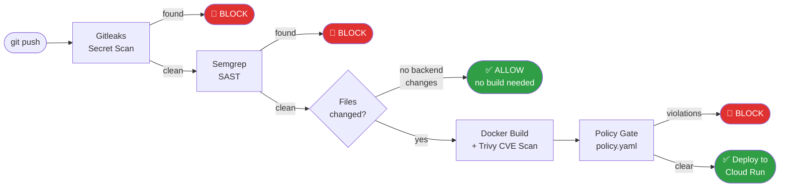

# 🛡️ SecureFlow

> Automated DevSecOps pipeline — scans every push for secrets, vulnerable code, and container CVEs, then deploys or blocks based on policy. Every result streams to a live dashboard in real time.


---

## How It Works

Every push to `main` runs through three security gates before anything reaches production:



When anything is blocked, an AI explains what was found, why it matters, and exactly how to fix it — shown directly on the dashboard.

---

## Key Features

**Three-layer scanning** — Gitleaks scans git history (not just current files) for secrets. Semgrep checks OWASP Top 10 patterns. Trivy scans the built Docker image for CVEs across all severity levels.

**Policy gate** — A `policy.yaml` file controls what blocks vs warns per repo, with per-CVE allowlisting and expiry dates. The policy reloads on every request so changes take effect without restarting the server.

**AI analysis** — Every block triggers an AI explanation with specific CVE names, exploit paths, and numbered remediation steps. Uses a Groq → Gemini → Ollama fallback chain so the pipeline never fails due to an AI outage.

**AI Copilot** — Chat panel on the dashboard for asking free-form questions about scan history ("why did my last 3 pushes get blocked?"). Read-only by design — cannot retrigger scans or change decisions.

**Real-time dashboard** — Single React page with WebSocket updates. Pipeline step status updates live as GitHub Actions progresses. A watchdog closes any run stuck at "running" after 20 minutes.

**Smart change detection** — Diffs `BEFORE_SHA..AFTER_SHA` on every push. Only rebuilds the Docker image if backend files changed. Frontend-only changes skip the image build entirely. Add `[deploy]` to a commit message to force a full deploy regardless.

**Blue-green deployment** — New Cloud Run revisions are deployed with zero traffic, verified, then promoted. Previous revision stays live until promotion succeeds — automatic rollback on health check failure.

---

## Policy Gate

```yaml
# policy.yaml — reloads on every scan, no restart needed
default:
  block_on: [CRITICAL, HIGH]
  warn_on: [MEDIUM]
  cvss_threshold: 7.0        # blocks MEDIUM CVEs with high CVSS scores too

repos:
  SecureFlow:
    block_on: [CRITICAL]     # relaxed: base image has unfixable OS-level HIGHs
    warn_on: [HIGH, MEDIUM]
    allowlist:
      - cve: CVE-2005-2541
        expires: 2026-12-01
        reason: "tar, no upstream fix, Debian ships it unfixed by design"
```

Allowlisted CVEs have expiry dates — nothing is silently ignored forever.

---

## AI Fallback Chain

```
Groq (llama-3.3-70b) → Gemini (flash-lite) → Ollama (qwen2.5:7b, local)
```

Each provider is only tried if its API key is configured. Ollama runs locally so scans never fully fail even without internet access.

---

## Tech Stack

| Layer | Tech |
|---|---|
| Pipeline | GitHub Actions |
| Secret scan | Gitleaks v8.24.3 |
| SAST | Semgrep (OWASP Top 10, Python, Secrets) |
| Container scan | Trivy |
| Backend | FastAPI + PostgreSQL + Redis |
| AI | Groq → Gemini → Ollama |
| Frontend | React + Recharts + WebSockets |
| Infra | GCP Cloud Run + Artifact Registry |
| Metrics | Prometheus + Grafana |

---

## Local Setup

```bash
git clone https://github.com/abhienix/SecureFlow.git
cd SecureFlow
docker compose up -d
```

| Service | URL |
|---|---|
| Dashboard | http://localhost:3000 |
| Backend API | http://localhost:8000 |
| Grafana | http://localhost:3001 (admin/admin) |

### Required GitHub Secrets

| Secret | Value |
|---|---|
| `BACKEND_URL` | Deployed backend URL |
| `GCP_SA_KEY` | GCP service account JSON |

---

## Project Structure

```
SecureFlow/
├── .github/workflows/secureflow.yml   # 16-step CI/CD pipeline
├── backend/
│   ├── main.py                        # FastAPI — REST + WebSocket
│   ├── policy_engine.py               # Evaluates policy.yaml
│   └── ai_analysis.py                 # Groq → Gemini → Ollama chain
├── frontend/                          # React dashboard
├── policy.yaml                        # Security thresholds + allowlist
└── docker-compose.yml                 # Local dev stack
```

---

<p align="center">
Built by <a href="https://github.com/abhienix">Abhimanyu Kumar</a> ·
<a href="https://www.linkedin.com/in/abhimanyu-sec">LinkedIn</a>
</p>
