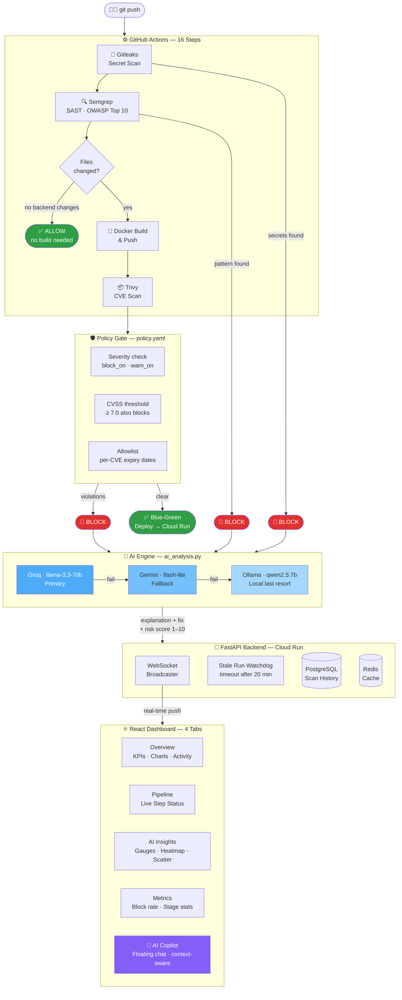

# 🛡️ SecureFlow

> Automated DevSecOps pipeline — scans every push for secrets, vulnerable code, and container CVEs, then deploys or blocks based on policy. Every result streams to a live React dashboard in real time.


**Live demo → https://secureflow-frontend-1083585992526.us-central1.run.app/**

---

## Architecture



---

## Key Features

**Three-layer scanning** — Gitleaks scans full git history for secrets (not just the working tree). Semgrep checks OWASP Top 10 patterns across four rulesets. Trivy scans the built Docker image for CVEs. Each is a hard gate.

**Policy gate** — `policy.yaml` controls block/warn thresholds per repo with per-CVE allowlisting and expiry dates. Reloads on every request, no server restart needed. A dual blocking condition catches MEDIUM CVEs with a CVSS score above the threshold.

**AI analysis** — Every block triggers a Groq → Gemini → Ollama fallback chain that generates a specific explanation (CVE IDs, exploit paths) and numbered fix steps with exact package versions. Never fails silently.

**AI Copilot** — Floating chat panel on the dashboard. Sends full scan context (recent 25 scans, aggregate stats, conversation history) with every question so answers are grounded in your actual pipeline data. Quick-action buttons for common queries. Read-only by design — cannot retrigger scans or flip decisions.

**Real-time WebSocket dashboard** — Single React page, four tabs. Pipeline step indicators update live as GitHub Actions runs. A stale-run watchdog automatically closes any run stuck at "running" after 20 minutes so the dashboard never shows stale state.

**Smart change detection** — Only rebuilds Docker if backend files changed. Frontend-only pushes skip the image build and Trivy scan entirely. Add `[deploy]` to a commit message to force a full deploy regardless.

**Blue-green deployment** — New Cloud Run revision deploys at 0% traffic, gets health-checked, then promoted. Previous revision stays live until promotion succeeds.

---

## Dashboard — 4 Tabs

| Tab | What's inside |
|---|---|
| **Overview** | Health score, avg risk, block rate KPIs · Risk trend area chart · Allow vs block pie · Severity distribution bar · Security posture radar · Daily activity · Latest 5 commits |
| **Pipeline** | Live running pipelines with animated step nodes · Recent completed runs · Expand any commit to see full stage detail + AI analysis |
| **AI Insights** | Prometheus-style arc gauges (block rate, AI coverage, confidence) · Confidence histogram · Risk-by-repo heatmap · AI confidence vs risk scatter plot · All blocked commits with full AI explanations and remedies |
| **Metrics** | Daily scan volume · Risk distribution · Cumulative block rate · AI confidence over time · Pipeline stage pass rates |

---

## Policy Gate

```yaml
default:
  block_on: [CRITICAL, HIGH]
  warn_on: [MEDIUM]
  cvss_threshold: 7.0        # blocks MEDIUM CVEs with CVSS ≥ 7.0 too

repos:
  SecureFlow:
    block_on: [CRITICAL]     # relaxed: base image has unfixable OS-level HIGHs
    warn_on: [HIGH, MEDIUM]
    allowlist:
      - cve: CVE-2005-2541
        expires: 2026-12-01
        reason: "tar, no upstream fix, Debian ships it unfixed by design"
```

---

## AI Fallback Chain

```
Groq (llama-3.3-70b-versatile) → Gemini (gemini-2.5-flash-lite) → Ollama (qwen2.5:7b, local)
```

Each provider only tried if its API key is configured. Ollama runs locally — pipeline never fully fails without internet access.

---

## Tech Stack

| Layer | Tech |
|---|---|
| Pipeline | GitHub Actions (16 steps) |
| Secret scan | Gitleaks v8.24.3 |
| SAST | Semgrep (OWASP Top 10, Python, Secrets) |
| Container scan | Trivy |
| Backend | FastAPI + PostgreSQL + Redis |
| AI | Groq → Gemini → Ollama |
| Frontend | React + Recharts + Framer Motion + WebSockets |
| Infra | GCP Cloud Run + Artifact Registry |
| Metrics | Prometheus + Grafana |

---

## Local Setup

```bash
git clone https://github.com/abhienix/SecureFlow.git
cd SecureFlow
docker compose up -d
```

| Service | URL |
|---|---|
| Dashboard | http://localhost:3000 |
| Backend API | http://localhost:8000 |
| Grafana | http://localhost:3001 (admin / admin) |

**Required GitHub Secrets:** `BACKEND_URL` · `GCP_SA_KEY`

---

## Project Structure

```
SecureFlow/
├── .github/workflows/secureflow.yml   # 16-step CI/CD pipeline
├── backend/
│   ├── main.py                        # FastAPI — REST + WebSocket + Copilot API
│   ├── policy_engine.py               # Evaluates policy.yaml per repo
│   └── ai_analysis.py                 # Groq → Gemini → Ollama fallback chain
├── frontend/
│   └── src/App.jsx                    # Single-page dashboard (4 tabs + AI Copilot)
├── policy.yaml                        # Security thresholds + CVE allowlist
└── docker-compose.yml                 # Local dev stack
```

---

<p align="center">
Built by <a href="https://github.com/abhienix">Abhimanyu Kumar</a> ·
<a href="https://www.linkedin.com/in/abhimanyu-sec">LinkedIn</a>
</p>
