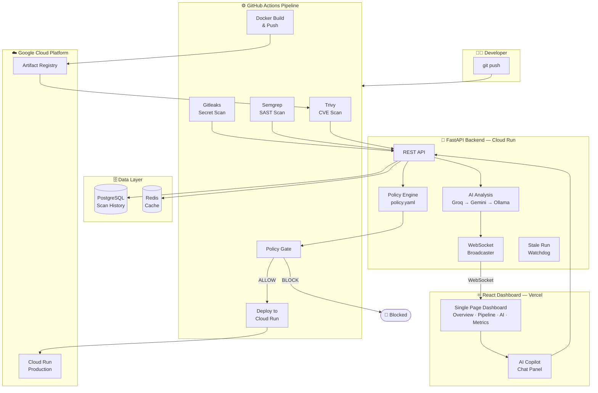
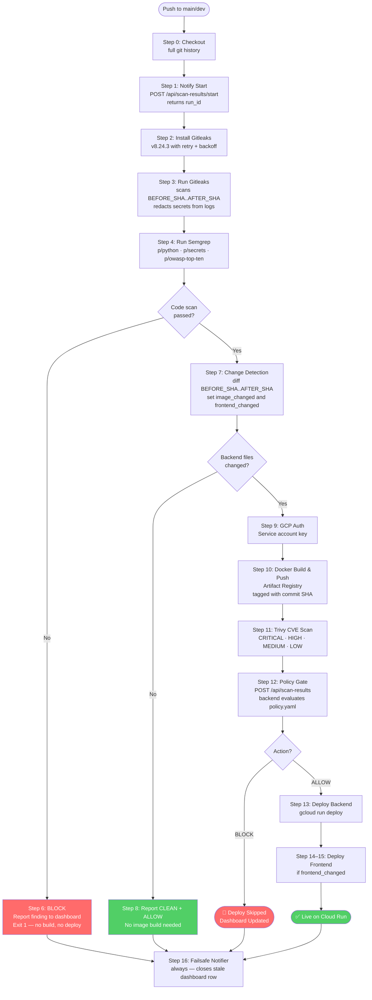
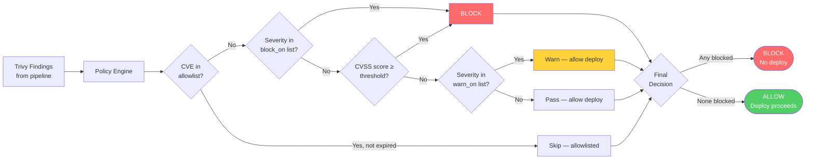
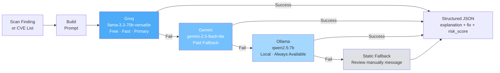
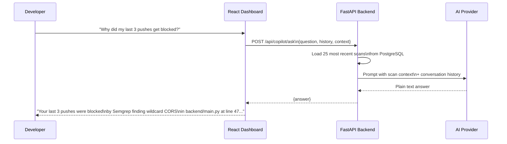
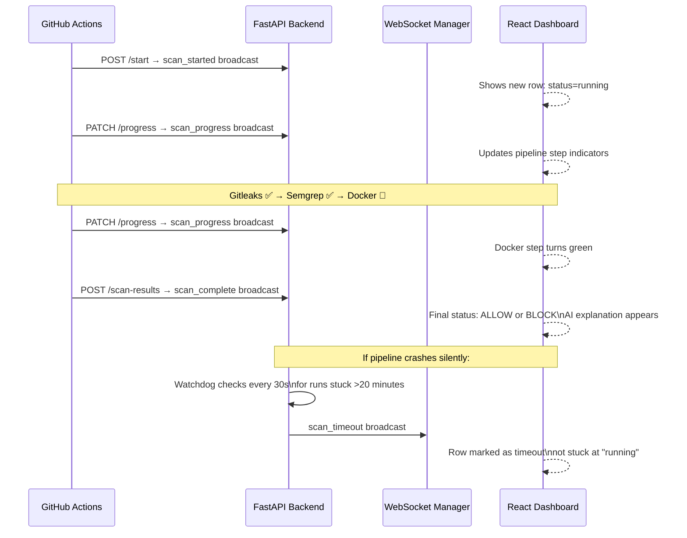
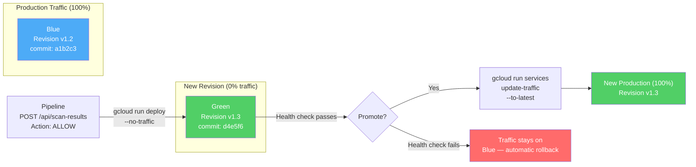
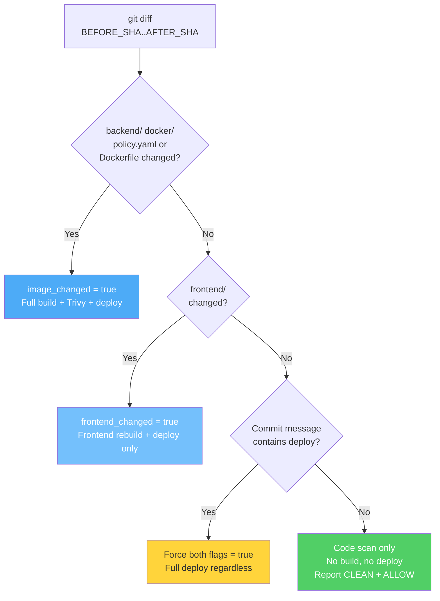

# 🛡️ SecureFlow — AI-Powered DevSecOps Pipeline

> **Every push to production goes through a security gauntlet first.** SecureFlow is a fully automated CI/CD security pipeline that scans for secrets, insecure code patterns, and container CVEs — then uses AI to explain what it found and a policy engine to decide whether to deploy or block. All of this is visible in real time on a single React dashboard.


---

## 📋 Table of Contents

- [What is SecureFlow?](#what-is-secureflow)
- [Live Demo Scenarios](#live-demo-scenarios)
- [Architecture Overview](#architecture-overview)
- [Pipeline Flow](#pipeline-flow)
- [Security Scanning Layer](#security-scanning-layer)
- [Policy Gate](#policy-gate)
- [AI Analysis Engine](#ai-analysis-engine)
- [AI Copilot](#ai-copilot)
- [Real-Time Dashboard](#real-time-dashboard)
- [Blue-Green Deployment](#blue-green-deployment)
- [Smart Change Detection](#smart-change-detection)
- [Tech Stack](#tech-stack)
- [Getting Started](#getting-started)
- [Security Policy Configuration](#security-policy-configuration)
- [Project Structure](#project-structure)

---

## What is SecureFlow?

SecureFlow was built to answer a question that comes up in every production engineering team: **how do you make security a non-negotiable part of every deployment, without slowing developers down?**

The answer here is to make security automatic, explainable, and visible. Every push to `main` or `dev` runs through three layers of scanning — secrets, code patterns, and container CVEs — before a single line reaches Cloud Run. If anything is blocked, an AI explains exactly what was found, why it's dangerous, and what to do about it. If it passes, it deploys.

The whole pipeline reports to a live React dashboard that shows pipeline step-by-step status in real time using WebSockets, with a stale-run watchdog so nothing ever gets stuck showing "running" forever.

---

## Live Demo Scenarios

These four pushes demonstrate every code path in the system:

| Push | What Triggers | Result |
|------|--------------|--------|
| Clean code, no changes to backend | Gitleaks ✅ Semgrep ✅ No image build | `ALLOW` — deploy skipped (nothing changed) |
| Hardcoded API key in source | Gitleaks finds it immediately | `BLOCK` — pipeline stops, AI explains what was found |
| OWASP Top 10 pattern (e.g. wildcard CORS) | Semgrep detects insecure pattern | `BLOCK` — AI explains the exploit path |
| Dockerfile change with known CVE in base image | Trivy scans built image, policy gate evaluates | `BLOCK` or `ALLOW` depending on policy thresholds |

---

## Architecture Overview



---

## Pipeline Flow



---

## Security Scanning Layer

SecureFlow runs three independent scanners in sequence. Each one is a hard gate — if it finds something that violates policy, the pipeline stops immediately and nothing gets built or deployed.

### Gitleaks — Secret Detection

Gitleaks scans every commit in the push window (`BEFORE_SHA..AFTER_SHA`) rather than just the latest state of the files. This means if you introduced a secret in commit 3 and removed it in commit 4, it still gets caught — the history was touched.

Secrets are redacted from GitHub Actions logs before they appear there. If the binary fails to download after three retries with exponential backoff, that failure itself gets reported to the dashboard rather than silently being skipped.

### Semgrep — Static Analysis (SAST)

Semgrep runs four rulesets simultaneously: `p/python` (Python-specific anti-patterns), `p/secrets` (credential patterns), `p/security-audit` (broad security checks), and `p/owasp-top-ten` (OWASP Top 10 categories). The finding count is written to `semgrep-results.json` and the first finding detail is sent to the dashboard when a block occurs.

A real example this caught during development: wildcard CORS (`allow_origins=["*"]`) in the FastAPI backend was flagged as an OWASP violation. Semgrep showed the exact file and line; the AI explained that it would let any origin call the API with credentials; the fix was restricting it to the specific frontend Cloud Run URL.

### Trivy — Container CVE Scanning

Trivy scans the Docker image only if backend files actually changed in this push (see Smart Change Detection below). It scans all four severity levels (CRITICAL, HIGH, MEDIUM, LOW) and writes the full results to `trivy-results.json`, which is uploaded as a GitHub Actions artifact for audit purposes. Only the top 20 findings are sent to the policy gate to avoid payload size issues.

---

## Policy Gate

The policy gate is the decision point at Step 12. The FastAPI backend receives Trivy's findings and evaluates them against `policy.yaml` to return either `ALLOW` or `BLOCK`.



### How the Policy Works

**Per-repo overrides** — The default policy blocks on CRITICAL and HIGH with a CVSS threshold of 7.0. SecureFlow's own image uses a slightly relaxed policy (block only on CRITICAL, warn on HIGH) because the Debian slim base image ships with OS-level packages like `perl-base`, `libc6`, and `tar` that have known CVEs with no available upstream fix. Blocking on HIGH would permanently block the project's own pipeline.

**Allowlisting** — Individual CVEs can be allowlisted with an expiry date and a reason. Once the expiry date passes, the CVE is treated normally again — nothing is silently ignored forever. This is the right pattern for "no fix available yet" situations rather than permanently suppressing the finding.

**Dual blocking condition** — A vulnerability is blocked if its severity label is in `block_on`, OR if its CVSS score meets the threshold, whichever is stricter. This catches cases where a distro labels something MEDIUM but the actual CVSS score is 8.5.

**Policy reloads on every request** — `policy.yaml` is read from disk each time the policy engine is called, not cached at startup. This means you can update the policy and the next pipeline run picks it up immediately without restarting the server. Critical when you need to quickly allowlist a CVE that's blocking production.

### Example policy.yaml

```yaml
default:
  block_on: [CRITICAL, HIGH]
  warn_on: [MEDIUM]
  cvss_threshold: 7.0

repos:
  SecureFlow:
    block_on: [CRITICAL]
    warn_on: [HIGH, MEDIUM]
    cvss_threshold: 7.0
    allowlist:
      - cve: CVE-2005-2541
        expires: 2026-12-01
        reason: "tar, ancient OS-level issue, Debian ships it unfixed by design"

notifications:
  slack: true
  on_block: true
  on_allow: false
```

---

## AI Analysis Engine

When a scan is blocked — whether by Gitleaks, Semgrep, or Trivy — the backend runs an AI analysis pass to generate a human-readable explanation and a concrete remediation plan. This is what the developer actually sees on the dashboard instead of a raw scanner dump.



The provider chain is Groq first (free tier, very fast, primary choice), Gemini as a paid fallback, and Ollama running locally as the last resort so the pipeline never fully dies without internet or API credits. Each provider is only tried if its API key exists in the environment — missing keys are skipped cleanly.

The AI is prompted differently depending on what triggered the block:

**For Trivy CVE findings**, the model is told to act as a senior DevSecOps engineer reviewing a Cloud Run deployment, name specific CVE IDs in the explanation, describe what an attacker could actually do, name the affected packages, and give numbered remediation steps with exact package versions. Vague advice is explicitly excluded from the prompt constraints.

**For Gitleaks or Semgrep blocks**, the model is told to quote the specific file, rule, or pattern from the scanner output, explain why this particular finding is dangerous rather than giving generic secret-management advice, and include credential rotation and git history cleanup commands in step 1 of the fix.

The analysis result (explanation + fix + risk score 1–10) is stored on the scan record and shown on the dashboard. A re-analyze button lets you trigger a fresh AI pass on any historical scan.

---

## AI Copilot

The dashboard includes an AI Copilot chat panel that lets you ask free-form questions about your pipeline history. It uses the same Groq → Gemini → Ollama fallback chain as the analysis engine, but produces conversational answers rather than structured JSON.



The copilot is read-only by design. Its system instructions explicitly tell the model it cannot re-run scans, change ALLOW/BLOCK decisions, or deploy anything. If asked to take an action, it says plainly that it can't and points to the relevant dashboard control instead. This prevents the model from misleadingly describing itself as having taken an action it has no access to perform.

Each request includes the 25 most recent scans as context, plus up to 6 turns of conversation history for follow-up questions. The context is capped so the prompt stays cheap regardless of how much scan history has accumulated.

---

## Real-Time Dashboard

The entire pipeline lifecycle is visible in a single React dashboard. There are no page refreshes — updates stream in over a persistent WebSocket connection.



The dashboard is a single React page with four tabs:

**Overview** — All-time stats (total runs, block rate, average risk score), a timeline chart of recent pipeline results, and a per-repo breakdown. Clicking any row opens the full detail view with the AI explanation and fix plan.

**Pipeline** — Live view of the currently running pipeline. Each step shows its status (running, PASS, BLOCK, skipped) as it happens. Step results arrive via WebSocket patches as the pipeline progresses through GitHub Actions.

**AI Insights** — Risk score distribution across all scans, most frequently blocked CVEs, top Semgrep rules that triggered, and trend charts. Built with Recharts.

**Metrics** — Prometheus metrics scraped from the FastAPI backend, displayed as Prometheus-style gauges. The backend is instrumented using `prometheus_fastapi_instrumentator` which auto-exposes request counts, latencies, and error rates at `/metrics`.

The WebSocket server maintains the connection with 30-second ping frames. Dead sockets are removed from the active set on the next broadcast attempt. If the browser disconnects and reconnects, the last known state is re-fetched via `GET /api/scan-results` and the WebSocket resumes from there.

---

## Blue-Green Deployment

SecureFlow uses Cloud Run's built-in traffic splitting to implement blue-green deployments. Each deploy tags the new revision with the commit SHA and initially sends it zero production traffic, allowing health verification before the cutover.



The backend and frontend are deployed as separate Cloud Run services (`secureflow-backend` and `secureflow-frontend`), so a frontend-only change doesn't trigger a backend redeploy and vice versa. The smart change detection step in the pipeline determines which services actually need to be updated.

If Cloud Run health checks on the new revision fail, traffic automatically stays on the previous revision — no manual intervention needed. The previous revision remains deployed and ready for instant rollback at any point.

---

## Smart Change Detection

The pipeline avoids unnecessary rebuilds by diffing the exact set of files changed between `BEFORE_SHA` and `AFTER_SHA`:



A commit message containing `[deploy]` overrides change detection and forces a full deploy of both services. This is the escape hatch when you need to deploy a config-only change that didn't touch any tracked files.

---

## Tech Stack

| Layer | Technology | Why |
|---|---|---|
| **CI/CD Pipeline** | GitHub Actions | Native to the repo, free for public repos, tight OIDC integration with GCP |
| **Secret Scanning** | Gitleaks v8.24.3 | Scans git history, not just working tree — catches secrets introduced and "removed" in the same PR |
| **SAST** | Semgrep | OWASP Top 10 rulesets, fast, deterministic, no false-positive rate of ML-based tools |
| **Container Scanning** | Trivy (Aqua Security) | Scans OS packages and app dependencies, outputs structured JSON, actively maintained |
| **Backend API** | FastAPI (Python) | Async-native for WebSocket support, auto-generates OpenAPI docs, Pydantic validation |
| **Database** | PostgreSQL 15 | All scan results stored permanently with JSONB columns for flexible findings storage |
| **Cache** | Redis 7 | Fast pub/sub for real-time updates, session caching |
| **AI Providers** | Groq → Gemini → Ollama | Free-tier primary, paid fallback, local last resort — pipeline never fails due to AI outage |
| **Container Registry** | GCP Artifact Registry | Regional registry co-located with Cloud Run, IAM-native auth, no separate credentials |
| **Deployment** | Google Cloud Run | Serverless, scales to zero, built-in HTTPS, traffic splitting for blue-green |
| **Metrics** | Prometheus + Grafana | Auto-instrumented via `prometheus_fastapi_instrumentator`, Grafana for visualization |
| **Frontend** | React + Recharts | Single-page dashboard, WebSocket client, chart components from Recharts |
| **Frontend Hosting** | Vercel | Zero-config React deployment, automatic preview deployments on PRs |

---

## Getting Started

### Prerequisites

- Docker and Docker Compose
- A Google Cloud project with Cloud Run and Artifact Registry enabled
- A GCP Service Account with Cloud Run Admin and Artifact Registry Writer roles
- GitHub repository secrets configured (see below)

### Required GitHub Secrets

| Secret | Description |
|---|---|
| `BACKEND_URL` | Your deployed backend URL, e.g. `https://secureflow-backend-xxx.run.app` |
| `GCP_SA_KEY` | GCP Service Account JSON key (raw JSON) |

### Local Development

```bash
git clone https://github.com/abhienix/SecureFlow.git
cd SecureFlow

# Start the full local stack (backend, frontend, postgres, redis, prometheus, grafana)
docker compose up -d
```

| Service | URL | Credentials |
|---|---|---|
| React Dashboard | http://localhost:3000 | — |
| Grafana | http://localhost:3001 | admin / admin |
| Prometheus | http://localhost:9090 | — |
| Backend API | http://localhost:8000 | — |
| PostgreSQL | localhost:5432 | postgres / password |

### Triggering the Pipeline

```bash
# Normal push — pipeline auto-detects what changed
git push origin main

# Force deploy both services regardless of file changes
git commit -m "fix: update config [deploy]"
git push origin main
```

### Manual Trivy Scan (local testing)

```bash
trivy image your-image:tag -f json -o trivy-results.json
python send_trivy_results.py
```

---

## Security Policy Configuration

Edit `policy.yaml` to control what gets blocked, warned, or allowed. Changes take effect on the next pipeline run — no server restart needed.

```yaml
default:
  block_on: [CRITICAL, HIGH]
  warn_on: [MEDIUM]
  cvss_threshold: 7.0          # Secondary block: catches MEDIUM CVEs with high CVSS

repos:
  SecureFlow:
    block_on: [CRITICAL]       # Relaxed: OS packages have unfixable HIGHs
    warn_on: [HIGH, MEDIUM]
    cvss_threshold: 7.0
    allowlist:
      - cve: CVE-2005-2541     # tar, ancient, Debian ships unfixed
        expires: 2026-12-01
        reason: "no upstream fix available, OS-level package"

notifications:
  slack: true
  on_block: true
  on_allow: false              # Don't alert on clean runs — avoid alert fatigue
```

---

## Project Structure

```
SecureFlow/
├── .github/
│   └── workflows/
│       └── secureflow.yml       # Main CI/CD + security pipeline (16 steps)
├── backend/
│   ├── main.py                  # FastAPI app: REST + WebSocket endpoints
│   ├── policy_engine.py         # Evaluates policy.yaml against scan findings
│   ├── ai_analysis.py           # Groq → Gemini → Ollama fallback chain
│   ├── models.py                # SQLAlchemy ORM models
│   └── slack_notifier.py        # Slack alerts on BLOCK
├── frontend/                    # React dashboard (four tabs, WebSocket client)
├── docker/
│   └── Dockerfile               # Backend container definition
├── prometheus/
│   └── prometheus.yml           # Prometheus scrape config
├── docker-compose.yml           # Full local dev stack
├── policy.yaml                  # Security policy — edit this to change thresholds
├── send_trivy_results.py        # Manual Trivy result submission for local testing
└── trivy-results.json           # Last scan output (gitignored in production)
```

---

## Open TODOs

- [ ] Slack webhook integration for BLOCK notifications (backend is wired, webhook URL pending)
- [ ] Grafana dashboard JSON export for one-click provisioning
- [ ] SBOM generation with Syft alongside Trivy
- [ ] Unit tests for the policy engine
- [ ] Helm chart for Kubernetes deployment

---

## License

MIT — see [LICENSE](LICENSE)

---

<p align="center">
  Built by <a href="https://github.com/abhienix">Abhimanyu Kumar</a> ·
  <a href="https://www.linkedin.com/in/abhimanyu-sec">LinkedIn</a>
</p>
