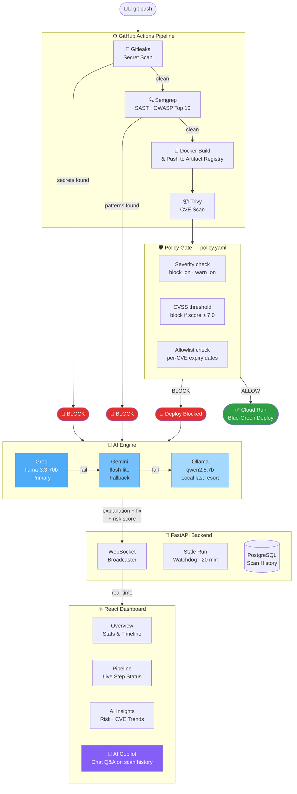

# 🛡️ SecureFlow

> Automated DevSecOps pipeline — scans every push for secrets, vulnerable code, and container CVEs, then deploys or blocks based on policy. Every result streams to a live dashboard in real time.


**Live demo → https://secureflow-frontend-1083585992526.us-central1.run.app/**

---

## Architecture



---

## Key Features

**Three-layer scanning** — Gitleaks scans full git history for secrets (not just the working tree). Semgrep checks OWASP Top 10 patterns. Trivy scans the built Docker image for CVEs. Each is a hard gate — one finding stops the pipeline.

**Policy gate** — `policy.yaml` controls block/warn thresholds per repo with per-CVE allowlisting and expiry dates. Reloads on every request, no server restart needed.

**AI analysis** — Every block triggers a Groq → Gemini → Ollama fallback chain that generates a specific explanation (CVE IDs, exploit paths) and numbered fix steps. Never fails silently — falls back to a static message if all providers are down.

**AI Copilot** — Chat panel on the dashboard. Ask anything about your scan history: *"why did my last 3 pushes get blocked?"*, *"what's my highest risk CVE this week?"*. Read-only by design — cannot retrigger scans or flip decisions.

**Real-time WebSocket dashboard** — Single React page. Pipeline step indicators update live as GitHub Actions runs. A watchdog automatically closes any run stuck at "running" after 20 minutes.

**Smart change detection** — Only rebuilds Docker if backend files changed. Frontend-only pushes skip the image build. Add `[deploy]` to a commit message to force a full deploy.

**Blue-green deployment** — New Cloud Run revision deploys at 0% traffic, gets health-checked, then promoted. Previous revision stays live until promotion succeeds.

---

## Policy Gate

```yaml
default:
  block_on: [CRITICAL, HIGH]
  warn_on: [MEDIUM]
  cvss_threshold: 7.0        # blocks MEDIUM CVEs with CVSS ≥ 7.0 too

repos:
  SecureFlow:
    block_on: [CRITICAL]     # relaxed: base image has unfixable OS-level HIGHs
    warn_on: [HIGH, MEDIUM]
    allowlist:
      - cve: CVE-2005-2541
        expires: 2026-12-01
        reason: "tar, no upstream fix, Debian ships it unfixed by design"
```

---

## Tech Stack

| Layer | Tech |
|---|---|
| Pipeline | GitHub Actions |
| Secret scan | Gitleaks v8.24.3 |
| SAST | Semgrep (OWASP Top 10, Python, Secrets) |
| Container scan | Trivy |
| Backend | FastAPI + PostgreSQL + Redis |
| AI | Groq → Gemini → Ollama |
| Frontend | React + Recharts + WebSockets |
| Infra | GCP Cloud Run + Artifact Registry |
| Metrics | Prometheus + Grafana |

---

## Local Setup

```bash
git clone https://github.com/abhienix/SecureFlow.git
cd SecureFlow
docker compose up -d
```

| Service | URL |
|---|---|
| Dashboard | http://localhost:3000 |
| Backend API | http://localhost:8000 |
| Grafana | http://localhost:3001 (admin / admin) |

**Required GitHub Secrets:** `BACKEND_URL` · `GCP_SA_KEY`

---

## Project Structure

```
SecureFlow/
├── .github/workflows/secureflow.yml   # 16-step CI/CD pipeline
├── backend/
│   ├── main.py                        # FastAPI — REST + WebSocket + Copilot
│   ├── policy_engine.py               # Evaluates policy.yaml
│   └── ai_analysis.py                 # Groq → Gemini → Ollama chain
├── frontend/                          # React dashboard (4 tabs + AI Copilot)
├── policy.yaml                        # Security thresholds + allowlist
└── docker-compose.yml                 # Local dev stack
```

---

<p align="center">
Built by <a href="https://github.com/abhienix">Abhimanyu Kumar</a> ·
<a href="https://www.linkedin.com/in/abhimanyu-sec">LinkedIn</a>
</p>
