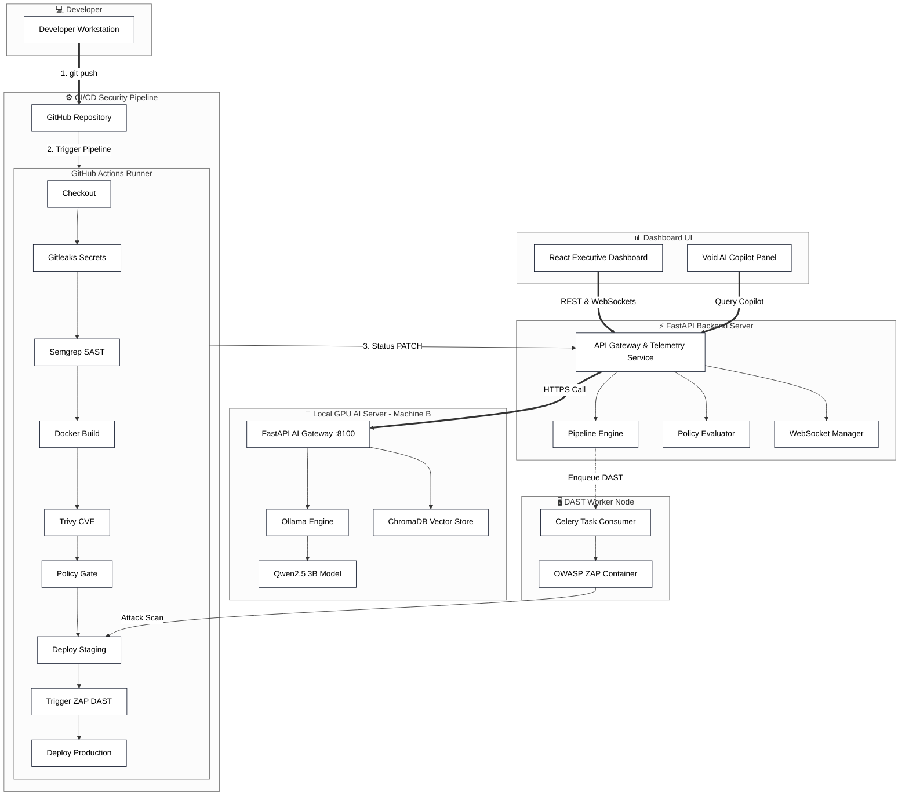

# SecureFlow – Automated DevSecOps Pipeline with AI Security Analysis

[](https://github.com/abhienix/SecureFlow/actions)
[](LICENSE)
[](https://fastapi.tiangolo.com/)
[](https://reactjs.org/)
[](ai-server/)
[](worker/)
[](https://trivy.dev/)
[](https://semgrep.dev/)
[](https://github.com/gitleaks/gitleaks)

I built **SecureFlow** to automate security scanning in CI/CD pipelines and give developers instant, real-time feedback whenever they push code. 

Instead of waiting for manual security reviews, SecureFlow automatically checks every commit and pull request for leaked secrets, static code vulnerabilities, container CVEs, and live API flaws. If a critical issue is found, it blocks the build before bad code hits production.

It also comes with a built-in AI companion named **Void AI** that runs 100% locally on a dedicated GPU to explain security findings and provide exact code fixes without sending your code to external cloud AI APIs.

---

## 🤔 Why I Built SecureFlow

In standard development workflows, security scans are often slow, disconnected from the dashboard, or rely on expensive cloud AI services that leak code snippets. 

I wanted to solve three big problems:
1. **No Real-Time Visibility**: Most CI/CD security tools run silently in GitHub Actions. I built a live React dashboard with WebSockets so you can watch your security scans run in real time with < 15ms latency.
2. **Preventing Bad Deploys**: If Semgrep or OWASP ZAP finds a high-risk flaw, the pipeline engine automatically blocks the deployment and marks downstream steps as skipped.
3. **100% Local AI Security Copilot**: Instead of paying for OpenAI or Groq tokens, I set up a local GPU AI server running `Qwen2.5` and `ChromaDB` vector embeddings. It gives smart security answers and line-by-line code patches for $0 cost.

---

## 🏛️ System Architecture

Here is the high-level flow of how code moves from a developer's machine through security scans and onto the dashboard:


```mermaid
%%{init: {'theme': 'neutral', 'themeVariables': { 'background': '#ffffff', 'primaryColor': '#ffffff', 'primaryTextColor': '#000000', 'primaryBorderColor': '#000000', 'lineColor': '#333333'}}}%%
flowchart TD
    classDef default fill:#ffffff,stroke:#0f172a,stroke-width:1px,color:#000000;

    subgraph Dev_Layer [💻 Developer]
        dev[Developer Workstation]
    end

    subgraph CICD_Layer [⚙️ CI/CD Security Pipeline]
        github[GitHub Repository]
        subgraph GHA_Pipeline [GitHub Actions Runner]
            c1[Checkout] --> c2[Gitleaks Secrets] --> c3[Semgrep SAST] --> c4[Docker Build] --> c5[Trivy CVE] --> c6[Policy Gate] --> c7[Deploy Staging] --> c8[Trigger ZAP DAST] --> c9[Deploy Production]
        end
    end

    subgraph Client_Layer [📊 Dashboard UI]
        dashboard[React Executive Dashboard]
        void_drawer[Void AI Copilot Panel]
    end

    subgraph Backend_Layer [⚡ FastAPI Backend Server]
        gateway[API Gateway & Telemetry Service]
        pipe_svc[Pipeline Engine]
        pol_svc[Policy Evaluator]
        ws_mgr[WebSocket Manager]
        
        gateway --> pipe_svc
        gateway --> pol_svc
        gateway --> ws_mgr
    end

    subgraph AI_Layer [🧠 Local GPU AI Server - Machine B]
        fastapi_ai[FastAPI AI Gateway :8100]
        ollama[Ollama Engine]
        qwen[Qwen2.5 3B Model]
        chroma[ChromaDB Vector Store]

        fastapi_ai --> chroma
        fastapi_ai --> ollama
        ollama --> qwen
    end

    subgraph Worker_Layer [🖥️ DAST Worker Node]
        celery[Celery Task Consumer]
        zap[OWASP ZAP Container]
        celery --> zap
    end

    dev ==>|1. git push| github
    github -->|2. Trigger Pipeline| GHA_Pipeline
    GHA_Pipeline -->|3. Status PATCH| gateway
    
    dashboard ==>|REST & WebSockets| gateway
    void_drawer ==>|Query Copilot| gateway
    gateway ==>|HTTPS Call| fastapi_ai

    pipe_svc -.->|Enqueue DAST| celery
    zap -->|Attack Scan| c7
```

---

## 📁 Repository Map

The codebase is organized into four main isolated folders so everything is easy to find and manage:

```text
SecureFlow/
├── ai-server/        # Machine B: Local GPU AI Server (FastAPI + Ollama + Qwen2.5 + ChromaDB)
├── backend/          # Cloud API Gateway & Telemetry Server (FastAPI + WebSockets + SQLite/PostgreSQL)
├── worker/           # Distributed DAST Scanner (Celery + Redis + OWASP ZAP)
├── frontend/         # Executive Security Dashboard (React 19 + TypeScript + Framer Motion)
├── .github/          # GitHub Actions workflows for security pipelines & quick deploys
└── policy.yaml       # Zero-Trust security policy rules & vulnerability thresholds
```

---

## 🛠️ Core Features

- **Secret Detection**: Runs **Gitleaks** to catch API keys, passwords, and private tokens before they are committed.
- **Static Analysis (SAST)**: Scans source code with **Semgrep** for OWASP Top 10 security bugs.
- **Container Scanning (SCA)**: Uses **Trivy** to inspect Docker base images for known CVEs.
- **Dynamic Testing (DAST)**: Runs **OWASP ZAP** out-of-process via Celery to test live endpoints for XSS, SQLi, and missing security headers.
- **Monotonic Pipeline Engine**: Ensures step statuses (`PASS`, `BLOCK`, `SKIPPED`) update deterministically without race conditions.
- **Void AI Copilot**: A local assistant that answers questions about your commit history, scan findings, and OWASP fixes.

---

## 🎯 Key Design Choices (Interview Q&A)

### Why separate the AI Server to a local GPU machine?
Cloud AI providers (OpenAI/Gemini) cost money per request and require sending source code snippets to external servers. By running Ollama with `Qwen2.5:3b` and `ChromaDB` on a local NVIDIA GPU (Machine B), all code stays completely private, runs with zero token cost, and responds in under 300ms.

### Why run DAST scanning in a separate worker process?
OWASP ZAP scans can take several minutes and use a lot of CPU. Running ZAP inside the main API server would block user requests and slow down the dashboard. I decoupled DAST scanning into an asynchronous Celery worker backed by Redis.

### How does the real-time dashboard work?
Whenever GitHub Actions or the DAST worker finishes a step, it sends a lightweight HTTP request to the backend. The backend updates the database and immediately broadcasts the event over WebSockets to the React frontend, updating the UI in under 15ms.

---

## ⚡ Quick Start

### 1. Run Local GPU AI Server (Machine B)
```bash
cd ai-server
docker compose up -d --build
```

### 2. Run Backend API Server
```bash
cd backend
python -m venv venv
source venv/bin/activate  # On Windows: venv\Scripts\activate
pip install -r requirements.txt
uvicorn main:app --reload --port 8000
```

### 3. Run React Dashboard
```bash
cd frontend
npm install
npm start
```

Open `http://localhost:3000` in your browser to view the live dashboard!

---

## 👤 Author

Designed and built by **Abhimanyu Kumar** as a hands-on DevSecOps and AI security project. Licensed under the [MIT License](LICENSE).
