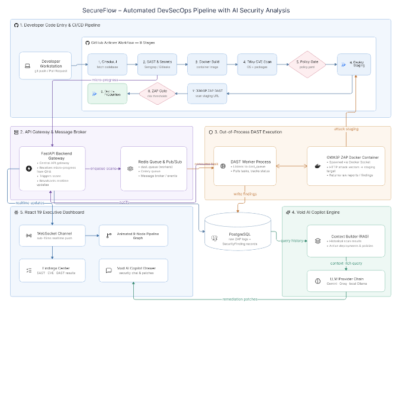

# 🛡️ SecureFlow — Enterprise DevSecOps Security Gate & Intelligence Platform

[](https://github.com/abhienix/SecureFlow/actions)
[](LICENSE)
[](https://fastapi.tiangolo.com/)
[](https://reactjs.org/)
[](https://www.docker.com/)
[](https://www.zaproxy.org/)
[](https://trivy.dev/)
[](https://semgrep.dev/)
[](https://github.com/gitleaks/gitleaks)
[](#-void-ai-copilot--enterprise-ai-server-architecture)

**SecureFlow** is an enterprise-grade, shift-left DevSecOps Security Intelligence & Automated Gating Platform. It monitors every commit and pull request for exposed secrets (Gitleaks), static analysis flaws (Semgrep), container vulnerabilities (Trivy), and dynamic web vulnerabilities (OWASP ZAP). SecureFlow enforces zero-trust security policies (`policy.yaml`), streams real-time telemetry over WebSockets (< 15ms latency), and features **Void AI** — an autonomous security copilot trained on codebase topology and scan findings.

---

## 🏛️ Master System Architecture (One-View Map)

Below is the complete, single-view architectural map showing how all core operational layers of SecureFlow interact:



### ✏️ Eraser.io Diagram-as-Code Specs

For a clean, uncoloured, whiteboard-style visual architecture, copy and paste the following specifications directly into [Eraser.io](https://www.eraser.io/):

<details>
<summary><b>1. Master System Architecture Flow (Click to Expand)</b></summary>

```text
// Nodes
developer [icon: "terminal", label: "Developer Git Push / PR"]

// CI/CD Workflow Group
subgraph CI_Pipeline [label: "GitHub Actions 9-Stage Pipeline"] {
  checkout [label: "1. Checkout"]
  code_scan [icon: "shield", label: "2. SAST & Secrets Scan"]
  docker_build [icon: "docker", label: "3. Docker Build"]
  trivy_scan [icon: "shield-check", label: "4. Trivy CVE Scan"]
  policy_gate [icon: "lock", label: "5. Policy Gate (yaml)"]
  deploy_staging [icon: "cloud", label: "6. Deploy Staging"]
  owasp_zap [icon: "bug", label: "7. OWASP ZAP DAST"]
  zap_gate [icon: "shield-alert", label: "8. ZAP Gate"]
  deploy_prod [icon: "rocket", label: "9. Deploy Production"]
}

// FastAPI Backend & DAST Cluster Group
subgraph Backend_Cluster [label: "FastAPI Backend & DAST Cluster"] {
  fastapi [icon: "cpu", label: "FastAPI Gateway"]
  redis_queue [icon: "database", label: "Redis & Celery Queue"]
  dast_worker [icon: "server", label: "DAST Worker Process"]
  zap_container [icon: "docker", label: "ZAP Docker Container"]
}

// Databases Group
subgraph Data_Layer [label: "Data & Cache Layer"] {
  postgres [icon: "postgresql", label: "PostgreSQL Database"]
  redis_cache [icon: "database", label: "Redis Cache"]
}

// AI Copilot Group
subgraph AI_Engine [label: "Void AI Copilot Engine"] {
  context_builder [icon: "settings", label: "Context Builder"]
  llm_router [icon: "cpu", label: "LLM Provider Chain"]
}

// Frontend Group
subgraph Frontend_App [label: "React 19 Executive Dashboard"] {
  node_graph [icon: "layout", label: "9-Node Animated Graph"]
  copilot_drawer [icon: "message-square", label: "Void AI Copilot Drawer"]
  security_hub [icon: "activity", label: "Security Center & Findings"]
}

// Connections
developer > checkout : "push / PR"
checkout > code_scan
code_scan > docker_build
docker_build > trivy_scan
trivy_scan > policy_gate
policy_gate > deploy_staging : "ALLOW"
deploy_staging > owasp_zap
owasp_zap > zap_gate
zap_gate > deploy_prod : "ALLOW"

// CI Progress streams to FastAPI
CI_Pipeline > fastapi : "Micro Progress PATCH"

// DAST Enqueue and execution
fastapi > redis_queue : "Enqueue Task"
redis_queue > dast_worker : "Pull Task"
dast_worker > zap_container : "Execute (Docker Socket)"
zap_container > deploy_staging : "HTTP Attack Vectors"
zap_container > dast_worker : "Scan Results (JSON)"
dast_worker > postgres : "Insert Findings"
dast_worker > fastapi : "WS Broadcast Trigger"

// Data persistence & cache
fastapi > postgres : "Read/Write State"
fastapi > redis_cache : "Heartbeat / Cache"

// WebSocket push to UI
fastapi > node_graph : "sub-15ms WebSocket"
fastapi > security_hub

// AI Context & flow
postgres > context_builder : "DB Scan History"
context_builder > llm_router : "RAG Context"
llm_router > copilot_drawer : "Security Insights & Patches"
```

</details>

<details>
<summary><b>2. DAST Out-of-Process Worker Flow (Click to Expand)</b></summary>

```text
// Define participants
GHA [icon: "github", label: "GitHub Actions"]
FastAPI [icon: "cpu", label: "FastAPI Gateway"]
Redis [icon: "database", label: "Redis Queue"]
Worker [icon: "server", label: "DAST Worker"]
Docker [icon: "docker", label: "ZAP Docker"]
DB [icon: "postgresql", label: "PostgreSQL DB"]
ReactApp [icon: "layout", label: "React Dashboard"]

// Sequence Flow
GHA > FastAPI : "POST /api/v1/dast/start"
FastAPI > DB : "Create ScanResult (status: QUEUED)"
FastAPI > Redis : "Push Job to dast_queue"
FastAPI > GHA : "200 OK / 202 Accepted"

Worker > Redis : "Pop Job from dast_queue"
Worker > DB : "Update status: RUNNING & assign worker"
Worker > Docker : "docker run -v ZAP scan target_url"
Docker > Worker : "Return scan findings JSON"

Worker > DB : "Store findings & update status: COMPLETED"
Worker > FastAPI : "WS Event trigger callback"
FastAPI > ReactApp : "Broadcast WS update (telemetry)"
```

</details>

<details>
<summary><b>3. Component Dependency Topology (Click to Expand)</b></summary>

```text
// Components
frontend [icon: "layout", label: "React 19 Frontend"]
api_gateway [icon: "cpu", label: "FastAPI API Gateway"]
worker_pool [icon: "server", label: "Out-of-Process Workers"]
db_pg [icon: "postgresql", label: "PostgreSQL DB"]
broker_redis [icon: "database", label: "Redis Queue & PubSub"]

// Layout groupings
Infrastructure {
  db_pg
  broker_redis
}

Services {
  api_gateway
  worker_pool
}

// Dependency Paths
frontend > api_gateway : "REST / WebSocket"
api_gateway > db_pg : "CRUD (SQLAlchemy)"
api_gateway > broker_redis : "Heartbeats & Queuing"
worker_pool > broker_redis : "Job Queue Poll"
worker_pool > db_pg : "Persist scan findings"
```

</details>

---

## 🌟 9-Stage DevSecOps Pipeline Flow

SecureFlow visualizes pipeline execution using an 9-node animated visual graph in 1-to-1 sync with GitHub Actions logs:

$$\begin{aligned}
\text{Checkout} &\longrightarrow \text{Code Scan} \longrightarrow \text{Docker Build} \longrightarrow \text{Trivy CVE} \longrightarrow \text{Policy Gate ①} \\
&\longrightarrow \text{Deploy Staging} \longrightarrow \text{OWASP ZAP DAST} \longrightarrow \text{ZAP Gate ②} \longrightarrow \text{Deploy Prod}
\end{aligned}$$

| Stage | Icon | Scanner / Tool | Description |
| :--- | :---: | :--- | :--- |
| **1. Checkout** | `GitBranch` | Git | Codebase checkout & HEAD SHA resolution |
| **2. Code Scan** | `Shield` | Gitleaks + Semgrep | SAST vulnerability audit & secret exposure check |
| **3. Docker Build** | `Box` | Docker | Container image assembly & Artifact Registry push |
| **4. Trivy CVE** | `ScanSearch` | Trivy SCA | Base image & package dependency CVE scanning |
| **5. Policy Gate ①** | `Lock` | Policy Engine | Evaluates `policy.yaml` rules against SAST/CVE findings |
| **6. Deploy Staging** | `Server` | Cloud Run | Deploys backend application to GCP staging environment |
| **7. OWASP ZAP** | `Bug` | OWASP ZAP | Executes dynamic DAST security scanning against staging URL |
| **8. ZAP Gate ②** | `ShieldCheck` | ZAP Gate | Verifies runtime DAST risk thresholds (Blocks on High/Critical) |
| **9. Deploy Prod** | `Rocket` | Cloud Run | Promotes approved image to production environment |

---

## 🚀 The 4 Pillars of 1-to-1 Real-Time Sync

1. **Step-by-Step Micro-Triggers**: Every step in `.github/workflows/security-pipeline.yml` fires a progress payload to `/api/scan-results/$RUN_ID/progress` when it starts and completes.
2. **Sub-15ms WebSocket Push (`/ws/events`)**: FastAPI broadcasts `scan_update` events over WebSockets to all connected dashboard clients in < 15ms.
3. **Sequential Stage Resolution (`PipelineNodeGraph.tsx`)**: Enforces `hasIncompleteSteps` so downstream nodes (`Deploy Staging`, `OWASP ZAP`, `ZAP Gate`, `Deploy Prod`) remain ⚪ `PENDING` until GitHub Actions actually executes them.
4. **3-Tier Reliability Safety Nets**:
   - **Tier 1 (Instant)**: Step-by-step CI progress curl calls.
   - **Tier 2 (Real-time)**: GitHub Webhooks (`/api/webhooks/github`).
   - **Tier 3 (Fallback)**: GitHub Actions API Watchdog (`github_polling_watchdog`) querying every 10s.

---

## 🤖 Void AI Copilot & Enterprise AI Server Architecture

Void is an autonomous security intelligence copilot built directly into the SecureFlow dashboard, backed by an enterprise RAG and multi-model AI Server architecture:

```text
AI Server
├── Ollama Engine
│      ├── DeepSeek (deepseek-coder:6.7b / deepseek-r1)
│      ├── Qwen (qwen2.5:7b / qwen2.5:3b)
│      └── nomic-embed-text (Vector Embedding Pipeline)
├── ChromaDB / Vector Store (RAG Storage)
├── MCP Server (Model Context Protocol)
├── RAG Engine (Retrieval-Augmented Generation)
├── Embedding Pipeline (Codebase & Finding Indexing)
├── AI Gateway (FastAPI REST & Sub-15ms WebSockets)
├── LLM Router (Task-Aware Model Dispatcher)
├── Context Builder (Real-Time DB State Ingestion)
├── Conversation Memory (Zustand State)
├── Prompt Manager & Security System Instructions
├── Remediation Engine (Line-by-Line Code Patches)
├── Security Knowledge Base (OWASP, CWE, CVE Rules)
└── Security Guardrails Engine (Context & Safety Boundary Filter)
```

### AI Component Architecture
- **RAG & Embedding Pipeline**: Uses `nomic-embed-text` with ChromaDB to index codebase snippets, CVE definitions, and OWASP remediation guidelines for semantic retrieval.
- **Intelligent LLM Router**: Dynamically dispatches code patch synthesis to **DeepSeek** (`deepseek-coder:6.7b` / `llama-3.3-70b`), general security analysis to **Qwen** (`qwen2.5:7b` / `gemini-2.0`), and fallback queries to local offline models.
- **AI Gateway & Context Builder**: Serves `/api/copilot/ask` REST queries and WebSocket events while ingesting real-time DB state (latest 50 scans, 50 earliest scans, 500 security findings, active Cloud Run deployments, policy definitions).
- **Exact Query Parsing**: Handles single commit lookups (`"tell me no 1 commit"` returns Commit #1 from repository history), range queries (`"show last 10 commits"`), negation filtering (`"not 610"`), and exact ID lookups (`"show scan 608"`).
- **Remediation Engine**: Synthesizes line-by-line code patches, sanitized query parameters, and credential rotation steps.
- **Security Guardrails Engine**: Enforces strict security domain boundaries, redacting sensitive tokens and rejecting off-topic prompts.

---

## 🧰 Tech Stack Breakdown

| Category | Component / Tool | Purpose / Usage |
| :--- | :--- | :--- |
| **CI/CD Pipeline** | GitHub Actions, Gitleaks, Semgrep, Trivy, OWASP ZAP | Pipeline automation, static analysis, container scanning & DAST |
| **Backend Core** | Python 3.11, FastAPI, Uvicorn, SQLAlchemy 2.0 (Async) | Async REST API, WebSockets, ORM data layer |
| **Worker & Queue** | Celery, Redis, GCP Compute Engine | Distributed DAST worker queue and container execution |
| **Database** | PostgreSQL 15 / SQLite, asyncpg, aiosqlite | Persistent storage for scan results, stages, findings, and policies |
| **AI Copilot** | Void AI Engine, Groq / Ollama / Gemini fallback | Autonomous vulnerability reasoning and remediation |
| **Frontend UI** | React 19, TypeScript, TanStack Query v5, Zustand, Recharts | Real-time executive security intelligence dashboard |
| **Hosting & Cloud** | Google Cloud Run, Artifact Registry, GCP Compute Engine | Production serverless backend hosting and worker node management |

---

## 📁 Repository Structure

```text
SecureFlow/
├── .github/
│   └── workflows/
│       ├── security-pipeline.yml     # Master CI/CD Security Pipeline & Policy Gate
│       ├── quick-deploy-backend.yml  # Backend Cloud Run Quick Deploy Workflow
│       └── quick-deploy-frontend.yml # Frontend Quick Deploy Workflow
├── backend/
│   ├── main.py                       # FastAPI Server, Routes, WebSockets & Watchdog
│   ├── models.py                     # SQLAlchemy Database Schema Models
│   ├── ai_analysis.py                # Void AI Copilot & Remediation Engine
│   ├── celery_client.py              # Celery Producer & Redis Broker Client
│   ├── pipeline_engine.py            # Monotonic Stage State Machine
│   ├── policy_engine.py              # Zero-Trust Policy Evaluator
│   └── requirements.txt              # Backend Dependencies
├── frontend/
│   ├── src/
│   │   ├── api/                      # Axios API Client & Endpoint Wrappers
│   │   ├── components/               # Layout, Navigation, TopBar & Global AI Copilot
│   │   ├── features/                 # Overview, Pipelines, Security, Deployments, Policies, Settings
│   │   ├── hooks/                    # Custom Hooks for WebSockets, Telemetry & Querying
│   │   ├── stores/                   # Consolidated Zustand Stores (uiStore, voidStore, etc.)
│   │   └── App.jsx                   # React 19 Main Application Shell
│   └── package.json
├── policy.yaml                       # Global Security Rules, CVSS Thresholds & Allow lists
└── README.md
```

---

## ⚡ Quick Start & Local Setup

### Prerequisites
- **Python**: 3.11+
- **Node.js**: 18+ & `npm`
- **Docker Engine**: Required for container build and DAST scanning

---

### 1. Backend Setup

```bash
git clone https://github.com/abhienix/SecureFlow.git
cd SecureFlow/backend

# Create and activate virtual environment
python -m venv venv
source venv/bin/activate  # On Windows: venv\Scripts\activate

# Install dependencies
pip install -r requirements.txt

# Start FastAPI development server
uvicorn main:app --reload --host 0.0.0.0 --port 8000
```

---

### 2. Frontend Setup

```bash
cd ../frontend

# Install dependencies
npm install

# Start React development server
npm start
```

The executive dashboard will be accessible at `http://localhost:3000`.

---

## ⚙️ Environment Configuration (`.env`)

Create `.env` in `backend/`:

```env
PORT=8000
BACKEND_API_SECRET=devsecops-pipeline-secret-2026
DATABASE_URL=sqlite+aiosqlite:///./secureflow_dev.db

# Celery & Redis Worker Broker
CELERY_BROKER_URL=redis://localhost:6379/0
REDIS_URL=redis://localhost:6379/0

# Optional AI Providers (Cloud or Local Ollama)
GROQ_API_KEY=gsk_your_groq_key_here
GEMINI_API_KEY=AIzaSy_your_gemini_key_here
OLLAMA_URL=http://localhost:11434

# Notifications
SLACK_WEBHOOK_URL=https://hooks.slack.com/services/YOUR/SLACK/WEBHOOK
```

---

## 🔑 Primary API Endpoints

| Method | Endpoint | Description |
| :--- | :--- | :--- |
| `POST` | `/api/scan-results/start` | Start a new scan run & trigger automated pipeline |
| `GET` | `/api/scan-results/{id}/progress` | Query scan progress, stage states, and DAST status |
| `PATCH`| `/api/scan-results/{id}/progress` | Progress telemetry callback endpoint for CI/CD & Worker VM |
| `GET` | `/api/scan-results` | Fetch historical scan runs & telemetry summaries |
| `POST` | `/api/copilot/ask` | Query Void AI Security Copilot |
| `GET` | `/api/policy` | View active security policies loaded from `policy.yaml` |
| `WS` | `/ws/events` | Real-time WebSocket event stream for dashboard updates |

Interactive OpenAPI documentation is available at `http://localhost:8000/docs`.

---

## 📜 License & Credits

Developed by **Abhimanyu Kumar** as an Enterprise DevSecOps Security Intelligence Platform. Licensed under the [MIT License](LICENSE).
