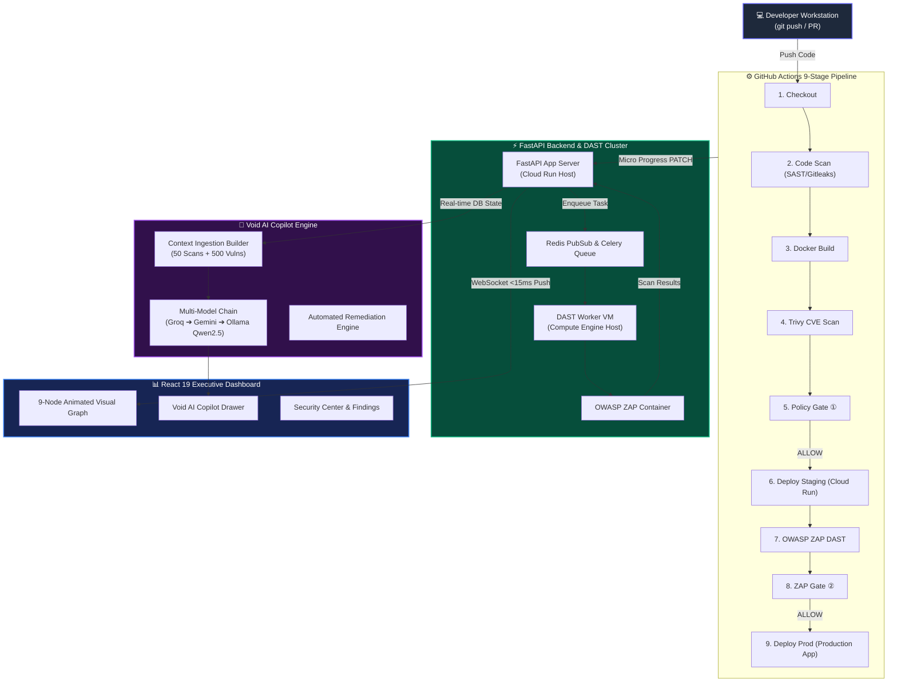

# 🛡️ SecureFlow — Enterprise DevSecOps Security Gate & Intelligence Platform

[](https://github.com/abhienix/SecureFlow/actions)
[](LICENSE)
[](https://fastapi.tiangolo.com/)
[](https://reactjs.org/)
[](https://www.docker.com/)
[](https://www.zaproxy.org/)
[](https://trivy.dev/)
[](https://semgrep.dev/)
[](https://github.com/gitleaks/gitleaks)
[](#-void-ai-copilot--enterprise-ai-server-architecture)

**SecureFlow** is an enterprise-grade, shift-left DevSecOps Security Intelligence & Automated Gating Platform. It monitors every commit and pull request for exposed secrets (Gitleaks), static analysis flaws (Semgrep), container vulnerabilities (Trivy), and dynamic web vulnerabilities (OWASP ZAP). SecureFlow enforces zero-trust security policies (`policy.yaml`), streams real-time telemetry over WebSockets (< 15ms latency), and features **Void AI** — an autonomous security copilot trained on codebase topology and scan findings.

---

## 🏛️ Master System Architecture (One-View Map)

Below is the complete, single-view architectural map showing how all 6 core operational layers of SecureFlow interact:


```mermaid
graph TD
    classDef dev fill:#1e293b,stroke:#6366f1,stroke-width:2px,color:#fff;
    classDef ci fill:#0f172a,stroke:#06b6d4,stroke-width:2px,color:#fff;
    classDef backend fill:#064e3b,stroke:#10b981,stroke-width:2px,color:#fff;
    classDef ai fill:#31104b,stroke:#a855f7,stroke-width:2px,color:#fff;
    classDef ui fill:#172554,stroke:#3b82f6,stroke-width:2px,color:#fff;

    Developer["💻 Developer Workstation<br/>(git push / PR)"]:::dev

    subgraph CI ["⚙️ GitHub Actions 9-Stage Pipeline"]
        Checkout["1. Checkout"]
        CodeScan["2. Code Scan (SAST/Gitleaks)"]
        DockerBuild["3. Docker Build"]
        TrivyScan["4. Trivy CVE Scan"]
        PolicyGate["5. Policy Gate ①"]
        DeployStaging["6. Deploy Staging (Cloud Run)"]
        OWASPZAP["7. OWASP ZAP DAST"]
        ZAPGate["8. ZAP Gate ②"]
        DeployProd["9. Deploy Prod (Production App)"]
    end
    class CI ci;

    subgraph Cluster ["⚡ FastAPI Backend & DAST Cluster"]
        FastAPI["FastAPI App Server<br/>(Cloud Run Host)"]
        RedisQueue["Redis PubSub & Celery Queue"]
        DASTWorker["DAST Worker VM<br/>(Compute Engine Host)"]
        ZAPContainer["OWASP ZAP Container"]
    end
    class Cluster backend;

    subgraph AI ["🤖 Void AI Copilot Engine"]
        ContextBuilder["Context Ingestion Builder<br/>(50 Scans + 500 Vulns)"]
        MultiModel["Multi-Model Chain<br/>(Groq ➔ Gemini ➔ Ollama Qwen2.5)"]
        Remediation["Automated Remediation Engine"]
    end
    class AI ai;

    subgraph Frontend ["📊 React 19 Executive Dashboard"]
        NodeGraph["9-Node Animated Visual Graph"]
        CopilotUI["Void AI Copilot Drawer"]
        SecurityHub["Security Center & Findings"]
    end
    class Frontend ui;

    Developer -->|Push Code| Checkout
    Checkout --> CodeScan --> DockerBuild --> TrivyScan --> PolicyGate
    PolicyGate -->|ALLOW| DeployStaging
    DeployStaging --> OWASPZAP --> ZAPGate
    ZAPGate -->|ALLOW| DeployProd

    CI -->|Micro Progress PATCH| FastAPI
    FastAPI -->|Enqueue Task| RedisQueue --> DASTWorker --> ZAPContainer
    ZAPContainer -->|Scan Results| FastAPI

    FastAPI -->|WebSocket <15ms Push| NodeGraph
    FastAPI -->|Real-time DB State| ContextBuilder --> MultiModel --> CopilotUI
```

```text
┌─────────────────────────────────────────────────────────────────────────────────────────────────────────────────────────┐
│                                       1. DEVELOPER CODE ENTRY & TRIGGER LAYER                                           │
│                                            Developer git push / Pull Request                                            │
└────────────────────────────────────────────────────────────┬────────────────────────────────────────────────────────────┘
                                                             │
                                                             ▼
┌─────────────────────────────────────────────────────────────────────────────────────────────────────────────────────────┐
│                                      2. GITHUB ACTIONS 9-STAGE SECURITY PIPELINE                                        │
│                                                                                                                         │
│  [1. Checkout] ──► [2. Code Scan] ──► [3. Docker Build] ──► [4. Trivy CVE] ──► [5. Policy Gate ①]                      │
│   (Git HEAD)      (SAST/Gitleaks)    (Container Build)    (Dependency SCA)   (policy.yaml Check)                        │
│                                                                                       │ ALLOW                           │
│                                                                                       ▼                                 │
│  [9. Deploy Prod] ◄── [8. ZAP Gate ②] ◄── [7. OWASP ZAP DAST] ◄────────────────── [6. Deploy Staging]                     │
│  (Production App)  (Runtime Threshold)   (Live App Scan)                           (Cloud Run Staging)                  │
└───────────────────────────────┬─────────────────────────────────────────────────────────────────────────────────────────┘
                                │
                                │ Micro-Payloads (Step Start & Finish)
                                ▼
┌─────────────────────────────────────────────────────────────────────────────────────────────────────────────────────────┐
│                                        3. FASTAPI BACKEND & DAST WORKER CLUSTER                                         │
│                                                                                                                         │
│ ┌───────────────────────────┐    Celery Task    ┌───────────────────────────┐    Docker SDK    ┌──────────────────────┐ │
│ │ FastAPI Application API   ├──────────────────►│ Redis Queue + Celery      ├─────────────────►│ OWASP ZAP Container  │ │
│ │ (GCP Cloud Run Server)    │◄──────────────────┤ Worker (Compute Engine VM)│◄─────────────────┤ (Dynamic Scanner)    │ │
│ └─────────────┬─────────────┘   Progress PATCH  └───────────────────────────┘   Report Payload └──────────────────────┘ │
└───────────────┼─────────────────────────────────────────────────────────────────────────────────────────────────────────┘
                │
                ├───────────────────────────────────────┐
                │                                       │
                ▼                                       ▼
┌───────────────────────────────┐     ┌───────────────────────────────────────────────────────────────────────────────────┐
│ 4. DATABASE & STORAGE LAYER   │     │ 5. VOID AI COPILOT & REASONING ENGINE                                             │
│                               │     │                                                                                   │
│ ┌───────────────────────────┐ │     │ ┌───────────────────────┐  RAG / Memory  ┌──────────────────────────────────────┐ │
│ │ PostgreSQL 15 Database    │ │     │ │ Context Builder       ├─────────────────►│ Multi-Model Provider Chain           │ │
│ │ (ScanResults, PipelineRuns│ │     │ │ (50 Scans, 500 Vulns, │                  │ (Groq Llama-3.3 → Gemini 2.0         │ │
│ │  SecurityFindings, Policy)│ │     │ │  Deployments & Rules) │                  │  → Ollama Qwen2.5 Local Offline)     │ │
│ └─────────────┬─────────────┘ │     │ └───────────┬───────────┘                  └──────────────────┬───────────────────┘ │
└───────────────┼───────────────┘     └─────────────┼─────────────────────────────────────────────────┼───────────────────┘
                │                                   │                                                 │
                │ WebSocket Push                    │ AI Reasoning                                    │ Code Patch
                │ (< 15ms Telemetry)                │ Answers                                         │ Remediation
                ▼                                   ▼                                                 ▼
┌─────────────────────────────────────────────────────────────────────────────────────────────────────────────────────────┐
│                                       6. REACT 19 EXECUTIVE SECURITY DASHBOARD                                          │
│                                                                                                                         │
│  ┌─────────────────────────┐   ┌─────────────────────────┐   ┌─────────────────────────┐   ┌─────────────────────────┐  │
│  │ 9-Stage Animated Graph  │   │ Void AI Copilot Drawer  │   │ Security Center & Vulner│   │ Policy Engine & CVSS    │  │
│  │ (Step-by-Step 1:1 Sync) │   │ (Instant Security Chat) │   │ ability Detail Drawers  │   │ Histogram Simulation    │  │
│  └─────────────────────────┘   └─────────────────────────┘   └─────────────────────────┘   └─────────────────────────┘  │
└─────────────────────────────────────────────────────────────────────────────────────────────────────────────────────────┘
```

---

## 🌟 9-Stage DevSecOps Pipeline Flow

SecureFlow visualizes pipeline execution using an 9-node animated visual graph in 1-to-1 sync with GitHub Actions logs:

$$\begin{aligned}
\text{Checkout} &\longrightarrow \text{Code Scan} \longrightarrow \text{Docker Build} \longrightarrow \text{Trivy CVE} \longrightarrow \text{Policy Gate ①} \\
&\longrightarrow \text{Deploy Staging} \longrightarrow \text{OWASP ZAP DAST} \longrightarrow \text{ZAP Gate ②} \longrightarrow \text{Deploy Prod}
\end{aligned}$$

| Stage | Icon | Scanner / Tool | Description |
| :--- | :---: | :--- | :--- |
| **1. Checkout** | `GitBranch` | Git | Codebase checkout & HEAD SHA resolution |
| **2. Code Scan** | `Shield` | Gitleaks + Semgrep | SAST vulnerability audit & secret exposure check |
| **3. Docker Build** | `Box` | Docker | Container image assembly & Artifact Registry push |
| **4. Trivy CVE** | `ScanSearch` | Trivy SCA | Base image & package dependency CVE scanning |
| **5. Policy Gate ①** | `Lock` | Policy Engine | Evaluates `policy.yaml` rules against SAST/CVE findings |
| **6. Deploy Staging** | `Server` | Cloud Run | Deploys backend application to GCP staging environment |
| **7. OWASP ZAP** | `Bug` | OWASP ZAP | Executes dynamic DAST security scanning against staging URL |
| **8. ZAP Gate ②** | `ShieldCheck` | ZAP Gate | Verifies runtime DAST risk thresholds (Blocks on High/Critical) |
| **9. Deploy Prod** | `Rocket` | Cloud Run | Promotes approved image to production environment |

---

## 🚀 The 4 Pillars of 1-to-1 Real-Time Sync

1. **Step-by-Step Micro-Triggers**: Every step in `.github/workflows/security-pipeline.yml` fires a progress payload to `/api/scan-results/$RUN_ID/progress` when it starts and completes.
2. **Sub-15ms WebSocket Push (`/ws/events`)**: FastAPI broadcasts `scan_update` events over WebSockets to all connected dashboard clients in < 15ms.
3. **Sequential Stage Resolution (`PipelineNodeGraph.tsx`)**: Enforces `hasIncompleteSteps` so downstream nodes (`Deploy Staging`, `OWASP ZAP`, `ZAP Gate`, `Deploy Prod`) remain ⚪ `PENDING` until GitHub Actions actually executes them.
4. **3-Tier Reliability Safety Nets**:
   - **Tier 1 (Instant)**: Step-by-step CI progress curl calls.
   - **Tier 2 (Real-time)**: GitHub Webhooks (`/api/webhooks/github`).
   - **Tier 3 (Fallback)**: GitHub Actions API Watchdog (`github_polling_watchdog`) querying every 10s.

---

## 🤖 Void AI Copilot & Enterprise AI Server Architecture

Void is an autonomous security intelligence copilot built directly into the SecureFlow dashboard, backed by a multi-tiered AI Server architecture:

```text
AI Server
├── Ollama
│      ├── Qwen2.5:3B / Qwen2.5:7B
│      └── nomic-embed-text
├── ChromaDB / Vector Store
├── MCP Server (Model Context Protocol)
├── RAG Engine
├── Embedding Pipeline
├── AI Gateway (FastAPI)
├── Context Builder
├── Conversation Memory (Zustand)
├── Prompt Manager
├── Remediation Engine
├── Security Knowledge Base
└── Tool Registry
```

### AI Component Architecture
- **AI Gateway**: Serves `/api/copilot/ask` REST queries and streams sub-15ms WebSocket push events.
- **Context Builder**: Ingests real-time DB state (latest 50 scans, 50 earliest scans, 500 security findings, active Cloud Run deployments, policy definitions).
- **Multi-Model Provider Chain**: Primary Cloud LLM (`Groq` Llama-3.3-70B) $\rightarrow$ Secondary (`Gemini` 2.0) $\rightarrow$ Local Offline Inference (`Ollama` Qwen2.5) $\rightarrow$ Deterministic Smart Fallback.
- **Exact Query Parsing**: Handles single commit lookups (`"tell me no 1 commit"` returns Commit #1 from repository history), range queries (`"show last 10 commits"`), negation filtering (`"not 610"`), and exact ID lookups (`"show scan 608"`).
- **Remediation Engine**: Synthesizes line-by-line code patches, sanitized query parameters, and credential rotation steps.
- **Domain Guardrails**: Enforces strict security domain boundaries, rejecting off-topic prompts.

---

## 🧰 Tech Stack Breakdown

| Category | Component / Tool | Purpose / Usage |
| :--- | :--- | :--- |
| **CI/CD Pipeline** | GitHub Actions, Gitleaks, Semgrep, Trivy, OWASP ZAP | Pipeline automation, static analysis, container scanning & DAST |
| **Backend Core** | Python 3.11, FastAPI, Uvicorn, SQLAlchemy 2.0 (Async) | Async REST API, WebSockets, ORM data layer |
| **Worker & Queue** | Celery, Redis, GCP Compute Engine | Distributed DAST worker queue and container execution |
| **Database** | PostgreSQL 15 / SQLite, asyncpg, aiosqlite | Persistent storage for scan results, stages, findings, and policies |
| **AI Copilot** | Void AI Engine, Groq / Ollama / Gemini fallback | Autonomous vulnerability reasoning and remediation |
| **Frontend UI** | React 19, TypeScript, TanStack Query v5, Zustand, Recharts | Real-time executive security intelligence dashboard |
| **Hosting & Cloud** | Google Cloud Run, Artifact Registry, GCP Compute Engine | Production serverless backend hosting and worker node management |

---

## 📁 Repository Structure

```text
SecureFlow/
├── .github/
│   └── workflows/
│       ├── security-pipeline.yml     # Master CI/CD Security Pipeline & Policy Gate
│       ├── quick-deploy-backend.yml  # Backend Cloud Run Quick Deploy Workflow
│       └── quick-deploy-frontend.yml # Frontend Quick Deploy Workflow
├── backend/
│   ├── main.py                       # FastAPI Server, Routes, WebSockets & Watchdog
│   ├── models.py                     # SQLAlchemy Database Schema Models
│   ├── ai_analysis.py                # Void AI Copilot & Remediation Engine
│   ├── celery_client.py              # Celery Producer & Redis Broker Client
│   ├── pipeline_engine.py            # Monotonic Stage State Machine
│   ├── policy_engine.py              # Zero-Trust Policy Evaluator
│   └── requirements.txt              # Backend Dependencies
├── frontend/
│   ├── src/
│   │   ├── api/                      # Axios API Client & Endpoint Wrappers
│   │   ├── components/               # Layout, Navigation, TopBar & Global AI Copilot
│   │   ├── features/                 # Overview, Pipelines, Security, Deployments, Policies, Settings
│   │   ├── hooks/                    # Custom Hooks for WebSockets, Telemetry & Querying
│   │   ├── stores/                   # Consolidated Zustand Stores (uiStore, voidStore, etc.)
│   │   └── App.jsx                   # React 19 Main Application Shell
│   └── package.json
├── policy.yaml                       # Global Security Rules, CVSS Thresholds & Allow lists
└── README.md
```

---

## ⚡ Quick Start & Local Setup

### Prerequisites
- **Python**: 3.11+
- **Node.js**: 18+ & `npm`
- **Docker Engine**: Required for container build and DAST scanning

---

### 1. Backend Setup

```bash
git clone https://github.com/abhienix/SecureFlow.git
cd SecureFlow/backend

# Create and activate virtual environment
python -m venv venv
source venv/bin/activate  # On Windows: venv\Scripts\activate

# Install dependencies
pip install -r requirements.txt

# Start FastAPI development server
uvicorn main:app --reload --host 0.0.0.0 --port 8000
```

---

### 2. Frontend Setup

```bash
cd ../frontend

# Install dependencies
npm install

# Start React development server
npm start
```

The executive dashboard will be accessible at `http://localhost:3000`.

---

## ⚙️ Environment Configuration (`.env`)

Create `.env` in `backend/`:

```env
PORT=8000
BACKEND_API_SECRET=devsecops-pipeline-secret-2026
DATABASE_URL=sqlite+aiosqlite:///./secureflow_dev.db

# Celery & Redis Worker Broker
CELERY_BROKER_URL=redis://localhost:6379/0
REDIS_URL=redis://localhost:6379/0

# Optional AI Providers (Cloud or Local Ollama)
GROQ_API_KEY=gsk_your_groq_key_here
GEMINI_API_KEY=AIzaSy_your_gemini_key_here
OLLAMA_URL=http://localhost:11434

# Notifications
SLACK_WEBHOOK_URL=https://hooks.slack.com/services/YOUR/SLACK/WEBHOOK
```

---

## 🔑 Primary API Endpoints

| Method | Endpoint | Description |
| :--- | :--- | :--- |
| `POST` | `/api/scan-results/start` | Start a new scan run & trigger automated pipeline |
| `GET` | `/api/scan-results/{id}/progress` | Query scan progress, stage states, and DAST status |
| `PATCH`| `/api/scan-results/{id}/progress` | Progress telemetry callback endpoint for CI/CD & Worker VM |
| `GET` | `/api/scan-results` | Fetch historical scan runs & telemetry summaries |
| `POST` | `/api/copilot/ask` | Query Void AI Security Copilot |
| `GET` | `/api/policy` | View active security policies loaded from `policy.yaml` |
| `WS` | `/ws/events` | Real-time WebSocket event stream for dashboard updates |

Interactive OpenAPI documentation is available at `http://localhost:8000/docs`.

---

## 📜 License & Credits

Developed by **Abhimanyu Kumar** as an Enterprise DevSecOps Security Intelligence Platform. Licensed under the [MIT License](LICENSE).
