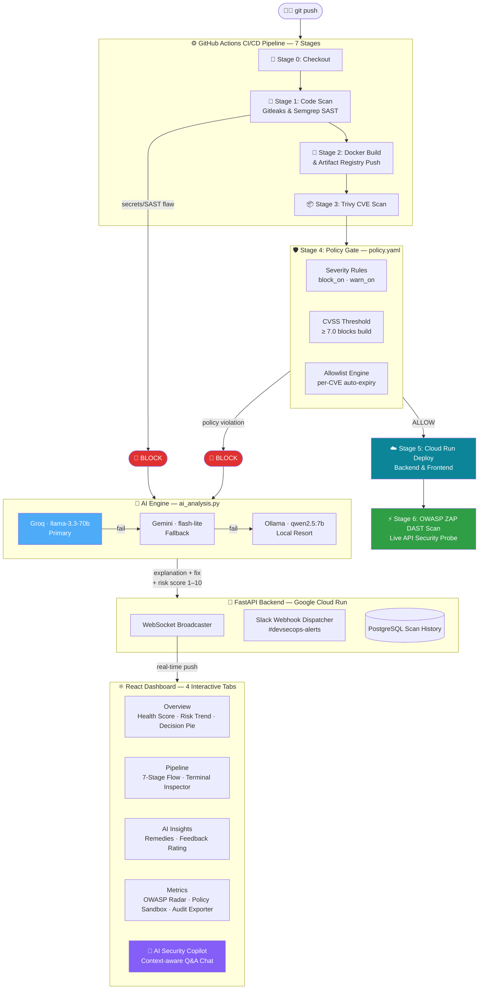

# 🛡️ SecureFlow — Enterprise DevSecOps Security Gate & Intelligence Platform

> **Full-Spectrum DevSecOps CI/CD Pipeline** — Scans every push for exposed secrets (**Gitleaks**), SAST code rules (**Semgrep**), container CVEs (**Trivy**), and live API runtime vulnerabilities (**OWASP ZAP DAST**). Enforces a dynamic policy gate (`policy.yaml`) and streams real-time telemetry to an interactive React dashboard with an AI Copilot security assistant.


**🚀 Live Production Dashboard → [https://secureflow-frontend-1083585992526.us-central1.run.app/](https://secureflow-frontend-1083585992526.us-central1.run.app/)**

---

## 🏗️ Architecture & DevSecOps Flow


```mermaid
graph TB
    DEV([👨‍💻 git push]) --> GHA

    subgraph GHA["⚙️ GitHub Actions CI/CD Pipeline — 7 Stages"]
        CK[🔄 Stage 0: Checkout]
        GL[🔑 Stage 1: Code Scan\nGitleaks & Semgrep SAST]
        DB[🐳 Stage 2: Docker Build\n& Artifact Registry Push]
        TV[📦 Stage 3: Trivy CVE Scan]
        CK --> GL --> DB --> TV
    end

    TV --> PG

    subgraph PG["🛡️ Stage 4: Policy Gate — policy.yaml"]
        SEV[Severity Rules\nblock_on · warn_on]
        CV[CVSS Threshold\n≥ 7.0 blocks build]
        AL[Allowlist Engine\nper-CVE auto-expiry]
    end

    GL -->|secrets/SAST flaw| BLK1([🚫 BLOCK])
    PG -->|policy violation| BLK2([🚫 BLOCK])

    PG -->|ALLOW| CR[☁️ Stage 5: Cloud Run Deploy\nBackend & Frontend]
    CR --> ZAP[⚡ Stage 6: OWASP ZAP DAST Scan\nLive API Security Probe]

    BLK1 & BLK2 --> AI

    subgraph AI["🤖 AI Engine — ai_analysis.py"]
        GR[Groq · llama-3.3-70b\nPrimary]
        GM[Gemini · flash-lite\nFallback]
        OL[Ollama · qwen2.5:7b\nLocal Resort]
        GR -->|fail| GM -->|fail| OL
    end

    AI -->|explanation + fix\n+ risk score 1–10| BE

    subgraph BE["🐍 FastAPI Backend — Google Cloud Run"]
        WS[WebSocket Broadcaster]
        SLK[Slack Webhook Dispatcher\n#devsecops-alerts]
        DB_PG[(PostgreSQL Scan History)]
    end

    WS -->|real-time push| DASH

    subgraph DASH["⚛️ React Dashboard — 4 Interactive Tabs"]
        OV[Overview\nHealth Score · Risk Trend · Decision Pie]
        PL[Pipeline\n7-Stage Flow · Terminal Inspector]
        INS[AI Insights\nRemedies · Feedback Rating]
        MT[Metrics\nOWASP Radar · Policy Sandbox · Audit Exporter]
        COP[🤖 AI Security Copilot\nContext-aware Q&A Chat]
    end

    style BLK1 fill:#e03131,color:#fff
    style BLK2 fill:#e03131,color:#fff
    style CR   fill:#0c8599,color:#fff
    style ZAP  fill:#2f9e44,color:#fff
    style GR   fill:#4dabf7,color:#fff
    style COP  fill:#845ef7,color:#fff
```

---

## 🔥 Key Innovations & Core Features

### 1. 🛡️ 4-Layer Security Stack (SAST + SCA + Secrets + DAST)
- **Secret Scanning (Gitleaks)**: Scans full git commit history for exposed API keys and credentials.
- **SAST (Semgrep)**: Checks OWASP Top 10 code patterns across Python and GitHub Actions workflow rules.
- **SCA Container Scanning (Trivy)**: Scans container images for CVE vulnerabilities.
- **DAST (OWASP ZAP)**: Dynamic security scanning against live deployed Cloud Run API endpoints (`https://secureflow-backend.../docs`).

### 2. 🎛️ Interactive Policy Engine Sandbox & SecOps Lock
- Dynamic evaluation via [`policy.yaml`](file:///c:/Users/Abhimanyu%20kumar/project/DevSecOps/SecureFlow/policy.yaml) with CVSS score thresholds and allowlists.
- **"What-If" Policy Simulator**: Interactive slider on the dashboard to test how tightening policy rules affects historical block rates.
- **SecOps Admin Authorization Lock**: Modifying production policy rules requires entering a SecOps Admin Key (`ADMIN-POLICY-KEY-2026`).

### 3. 📄 Executive Audit Exporter & Secret Masking
- Single-click **"Export Audit Report"** generator for compliance auditors (SOC 2, ISO 27001).
- **Role-Based Authorization & Secret Redaction**: Enforces auditor PIN verification (`SEC-AUDIT-2026`) and automatically redacts credentials (`[REDACTED_SECRET_KEY]`) in exported payloads.

### 4. 🤖 AI Remedy Engine & Copilot Assistant
- Every blocked commit triggers an AI fallback chain (**Groq → Gemini → Ollama**) generating root-cause explanations and single-click **"Copy Code Fix"** buttons.
- **User Feedback Rating Loop**: Rate AI analysis accuracy directly from the UI with feedback saved to PostgreSQL.
- **Context-Aware AI Copilot**: Floating chat panel equipped with scan focus selectors and DevSecOps prompt chips.

### 5. 💬 Real-Time Slack Security Webhook Dispatcher
- Dispatches formatted security alerts to `#devsecops-alerts` Slack channels on every `BLOCK` or `ALLOW` event with one-click dashboard test triggers.

---

## 📊 Dashboard Overview — 4 Tabs

| Tab | Key Features |
| :--- | :--- |
| **Overview** | Health Score Arc Gauge · Risk Trend Area Chart · Policy Decision Donut Chart · Scanner Breakdown Bar Chart (**Trivy**, **Gitleaks**, **Semgrep**, **OWASP ZAP**) · Live Feed |
| **Pipeline** | **7-Stage Visual Pipeline Diagram** · Expandable Stage Inspector with `$ command` logs and duration metrics · Full Commit SHA Copy |
| **AI Insights** | AI Remediation Cards · Single-click Code Fix Generator · Accuracy Feedback Loop (Accurate / Incorrect) |
| **Metrics & Policy** | **OWASP Top 10 Compliance Radar Chart** · Interactive Policy Sandbox Simulator · Active Policy Rules Matrix · Slack Dispatcher Card |

---

## ⚙️ Tech Stack & Security Tools

| Layer | Technology |
| :--- | :--- |
| **CI/CD Pipeline** | GitHub Actions (7-Stage Workflow) |
| **Secret Scanning** | Gitleaks v8.24.3 |
| **SAST** | Semgrep (OWASP Top 10, Python, Security Rules) |
| **Container SCA** | Trivy Container Vulnerability Scanner |
| **Runtime DAST** | OWASP ZAP (Zed Attack Proxy) Baseline API Scanner |
| **Policy Engine** | Custom Python Engine + PyYAML (`policy.yaml`) |
| **Backend** | FastAPI + PostgreSQL + SQLAlchemy + WebSockets |
| **AI Core** | Groq (`llama-3.3-70b`) ➔ Gemini (`flash-lite`) ➔ Ollama (`qwen2.5`) |
| **Frontend** | React + Recharts + Framer Motion + Lucide Icons |
| **Cloud Infra** | Google Cloud Run + Artifact Registry |

---

## 🛠️ Local Development Setup

```bash
# 1. Clone the repository
git clone https://github.com/abhienix/SecureFlow.git
cd SecureFlow

# 2. Start PostgreSQL, Redis & FastAPI backend
docker compose up -d

# 3. Start React frontend
cd frontend
npm install
npm start
```

| Service | Access URL |
| :--- | :--- |
| **React Dashboard** | `http://localhost:3000` |
| **FastAPI Docs** | `http://localhost:8000/docs` |
| **Cloud Run Production** | `https://secureflow-frontend-1083585992526.us-central1.run.app` |

---

<p align="center">
  Built by <a href="https://github.com/abhienix">Abhimanyu Kumar</a> · 
  <a href="https://www.linkedin.com/in/abhimanyu-sec">LinkedIn</a>
</p>
