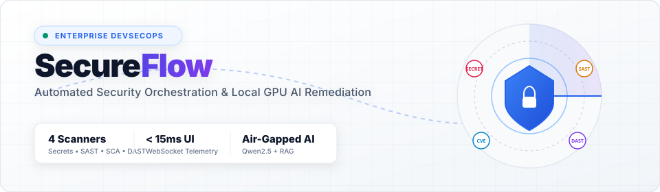
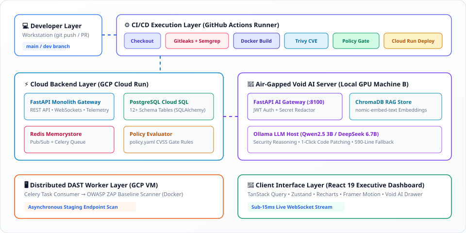
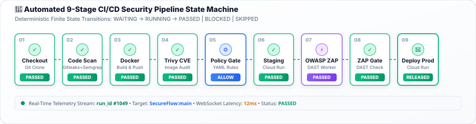
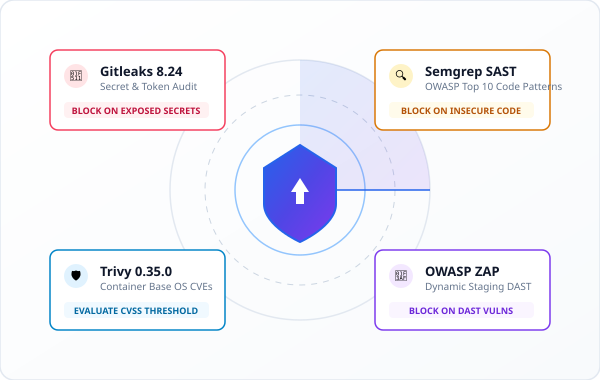
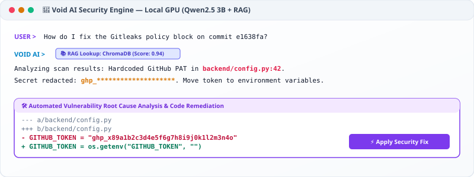
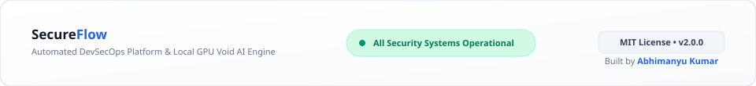

<p align="center">
  <a href="https://github.com/abhienix/SecureFlow">
    
  </a>
</p>

<p align="center">
  <strong>Automated DevSecOps Pipeline • Multi-Scanner Security Orchestration • Real-Time WebSockets • Local Air-Gapped AI</strong>
</p>

<p align="center">
  <a href="https://github.com/abhienix/SecureFlow/actions"></a>
  <a href="./backend/"></a>
  <a href="./frontend/"></a>
  <a href="./ai-server/"></a>
  <a href="./worker/"></a>
  <a href="./LICENSE"></a>
</p>

---

## ⚡ Overview

**SecureFlow** is an automated DevSecOps security orchestration platform engineered to solve scanner noise, build runner timeouts, and cloud data leaks in CI/CD pipelines.

It coordinates **4 security scanners** (Gitleaks, Semgrep, Trivy, and OWASP ZAP) across a **9-stage automated pipeline**, evaluates findings against a dynamic **YAML Policy Engine** (`policy.yaml`), streams real-time scan progress to an executive **React 19 Dashboard** over WebSockets (**<15ms latency**), and provides an **air-gapped Void AI Engine** (Ollama + ChromaDB RAG) for local, secret-scrubbed root cause analysis and automated code remediation.

---

## 🎯 Key Problems Solved

- **Scanner Noise & Format Fragmentation**: Standard tools produce incompatible JSON/text outputs. SecureFlow aggregates and normalizes all scan findings into a unified data model.
- **Unfixable OS-Level Build Blocks**: CI pipelines frequently fail on unfixable Debian base image CVEs (e.g. `libc6`, `perl-base`). SecureFlow uses [`policy.yaml`](./policy.yaml) with time-bound expiring allowlists to grant temporary grace periods with mandatory expiration dates.
- **Code Privacy Risks with Cloud AI**: Sending source code or credentials to external LLMs violates enterprise compliance. SecureFlow runs **Ollama locally on GPU** with regex secret scrubbing prior to vector embedding and inference.
- **Slow DAST Scans Freezing CI Runners**: OWASP ZAP web scans take 5–10 minutes. SecureFlow offloads DAST execution asynchronously to an out-of-process **Celery worker** on Redis task queues.
- **Lack of Real-Time Pipeline Observability**: Instead of waiting for full job completions, developers monitor real-time execution states streamed directly to the UI over **WebSockets**.

---

## 🏗️ Architecture Overview

<p align="center">
  <a href="./docs/Architecture.md">
    
  </a>
</p>

### Core Subsystems:
- **GitHub Actions Pipeline**: Triggers on push events, executing static analysis, container builds, and policy checks.
- **FastAPI Monolith Gateway**: Serves central REST endpoints, handles policy evaluation, and brokers live WebSocket frames.
- **Celery & Redis Worker Layer**: Executes asynchronous OWASP DAST scans out-of-process without blocking API handlers or CI runners.
- **React 19 Executive Dashboard**: Real-time telemetry, scanner charts, and interactive AI remediation drawers.
- **Air-Gapped Void AI Server**: Local GPU-hosted Ollama (`Qwen2.5 3B` / `DeepSeek-Coder 6.7B`) with ChromaDB RAG vector store.

---

## 🔄 9-Stage Security Pipeline

Every commit moves through a 9-stage pipeline state machine defined in [`.github/workflows/security-pipeline.yml`](./.github/workflows/security-pipeline.yml):

<p align="center">
  <a href="./docs/Pipeline.md">
    
  </a>
</p>

1. **Checkout**: Fetches complete commit history (`fetch-depth: 0`) for secret auditing.
2. **Code Scan**: Runs **Gitleaks** (secret detection) and **Semgrep** (SAST code flaws).
3. **Docker Build**: Compiles multi-stage production container image.
4. **Trivy CVE Scan**: Audits base OS packages and project dependencies.
5. **Policy Gate**: Evaluates total findings against rules in [`policy.yaml`](./policy.yaml).
6. **Staging Deploy**: Deploys container image to temporary staging environment.
7. **OWASP ZAP DAST**: Celery worker runs dynamic HTTP vulnerability attacks against staging.
8. **ZAP Gate**: Validates DAST scan results against dynamic policy thresholds.
9. **Production Deploy**: Promotes verified clean builds to production.

---

## 🛡️ Integrated Security Scanners

<p align="center">
  
</p>

- **🔑 Gitleaks**: Audits git history for leaked credentials and API tokens using custom rules in [`.gitleaks.toml`](./.gitleaks.toml).
- **🔍 Semgrep**: Audits Python backend and TypeScript frontend code for OWASP Top 10 vulnerabilities.
- **📦 Trivy**: Audits container base layers and package locks (`requirements.txt`, `package.json`) against CVE databases.
- **🌐 OWASP ZAP**: Runs dynamic web vulnerability attacks (XSS, SQLi, security headers) on live staging endpoints.

---

## 🧠 Air-Gapped Local AI Engine (Void AI)

<p align="center">
  
</p>

- **Local GPU Execution**: Operates locally via **Ollama** inside [`ai-server/`](./ai-server/) using `Qwen2.5 3B` for security reasoning and `DeepSeek-Coder 6.7B` for code patch generation.
- **Automatic Secret Redaction**: Scrubs API keys, tokens, and passwords into `[REDACTED_SECRET]` placeholders before LLM prompt evaluation.
- **RAG Context Integration**: Indexes `policy.yaml` rules and scanner documentation inside ChromaDB vector store.
- **Heuristic Fallback**: Automatically activates a 590-line rule-based engine in [`ai_analysis.py`](./backend/ai_analysis.py) if the local GPU server is unreachable.

---

## 💡 System Design & Engineering Decisions

- **FastAPI Monolith Gateway**: Chosen over microservices to support high-throughput async I/O for WebSockets and clean single-container deployment on GCP Cloud Run while eliminating microservice network latency.
- **Out-of-Process Celery DAST Workers**: Offloads OWASP ZAP scans (5–10 mins execution) to Celery task queues on Redis, keeping HTTP API handlers responsive and preventing GitHub Actions runner timeouts.
- **WebSockets over SSE**: Provides bi-directional persistent channels for sub-15ms server telemetry broadcasts and interactive client control actions (manual re-scans, AI remediation requests).
- **Expiring Allowlists in `policy.yaml`**: Prevents permanent vulnerability debt by requiring mandatory expiration dates and justification notes for allowed OS CVEs.

---

## 📂 Repository Structure

```text
SecureFlow/
├── .github/workflows/       # 9-Stage CI/CD GitHub Actions pipeline
├── ai-server/              # Local GPU AI server (Ollama + ChromaDB RAG)
├── assets/svg/             # Visual SVG architecture diagrams & banners
├── backend/                # FastAPI Gateway, Policy Engine & database layer
├── docker/                 # Production Dockerfile
├── docs/                   # Full documentation (Architecture, API, AI, Pipeline)
├── frontend/               # React 19 Executive Dashboard (TypeScript + TanStack)
├── worker/                 # Out-of-process Celery DAST worker (OWASP ZAP)
├── policy.yaml             # Dynamic security rules & CVE allowlists
└── README.md               # You are here!
```

---

## ⚡ Quick Start (Local Setup)

### Prerequisites:
- Python 3.12+
- Node.js 18+ & npm
- Docker & Docker Compose
- Redis Server

### Setup Steps:

1. **Backend API**:
   ```bash
   cd backend
   python -m venv venv
   source venv/bin/activate  # Windows: .\venv\Scripts\Activate.ps1
   pip install -r requirements.txt
   uvicorn main:app --reload --port 8000
   ```

2. **React Dashboard**:
   ```bash
   cd frontend
   npm install
   npm start  # Opens http://localhost:3000
   ```

3. **Celery DAST Worker**:
   ```bash
   cd worker
   pip install -r requirements.txt
   celery -A app.celery_app worker --loglevel=info
   ```

4. **Local AI Server**:
   ```bash
   cd ai-server
   docker compose up -d --build
   ```

---

## 📄 License & System Documentation

- **License**: Released under the [MIT License](./LICENSE).
- **System Documentation**:
  - [`docs/Architecture.md`](./docs/Architecture.md) — Technical Architecture & Data Flow
  - [`docs/API.md`](./docs/API.md) — REST API & Telemetry Endpoints
  - [`docs/AI.md`](./docs/AI.md) — Void AI RAG Architecture & Local Setup
  - [`docs/Pipeline.md`](./docs/Pipeline.md) — 9-Stage CI/CD Pipeline Guide
  - [`docs/Worker.md`](./docs/Worker.md) — Out-of-Process DAST Worker Setup

---

<p align="center">
  
</p>
