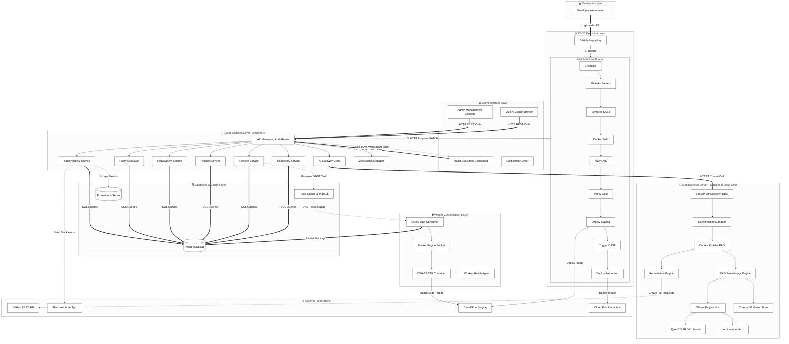

# 🛡️ SecureFlow – Enterprise Automated DevSecOps Pipeline & Local GPU AI Security Intelligence Platform

[](https://github.com/abhienix/SecureFlow/actions)
[](LICENSE)
[](https://fastapi.tiangolo.com/)
[](https://reactjs.org/)
[](ai-server/)
[](worker/)
[](https://trivy.dev/)
[](https://semgrep.dev/)
[](https://github.com/gitleaks/gitleaks)

**SecureFlow** is a production-grade, enterprise Shift-Left DevSecOps Security Intelligence & Automated Gating Platform. It monitors every commit and pull request for exposed secrets (Gitleaks), static code security flaws (Semgrep), container vulnerabilities (Trivy), and dynamic web application vulnerabilities (OWASP ZAP). 

SecureFlow enforces zero-trust security policies (`policy.yaml`), streams real-time telemetry over WebSockets (< 15ms latency), and features **Void AI** — a 100% local, GPU-accelerated security copilot backed by ChromaDB RAG Vector Store and local Qwen2.5 LLM inference.

---

## 🚀 Key Technical Highlights & Architecture Features

- 🔒 **100% Local GPU AI Processing**: Zero cloud API token costs or external data leakage. AI inference runs entirely on a dedicated local NVIDIA GPU workstation (Machine B) using `qwen2.5:3b` and `nomic-embed-text`.
- 🧠 **ChromaDB RAG Vector Store**: Indexes codebase topology, OWASP Top 10 guidelines, CWE definitions, and CVE remediation patterns for semantic RAG retrieval.
- ⚡ **Real-Time WebSocket Telemetry**: Sub-15ms push updates from CI/CD runners to the React 19 Executive Dashboard without polling overhead.
- 🛡️ **Zero-Trust Monotonic Security Gating**: Enforces automatic `BLOCK` decisions on Critical/High vulnerabilities before code reaches production servers.
- 🔄 **Distributed Out-of-Process DAST Scanning**: Heavy OWASP ZAP dynamic application security testing (DAST) runs asynchronously on isolated worker nodes via Celery and Redis.

---

## 🏛️ Master System Architecture (One-View Map)

Below is the complete single-view architectural map showing how all core operational layers interact:


```mermaid
%%{init: {'theme': 'neutral', 'themeVariables': { 'background': '#ffffff', 'primaryColor': '#ffffff', 'primaryTextColor': '#000000', 'primaryBorderColor': '#000000', 'lineColor': '#333333'}}}%%
flowchart TD
    classDef default fill:#ffffff,stroke:#0f172a,stroke-width:1px,color:#000000;

    subgraph Dev_Layer [💻 Developer Layer]
        dev[Developer Workstation]
    end

    subgraph CICD_Layer [⚙️ CI/CD Execution Layer]
        github[GitHub Repository]
        subgraph GHA_Pipeline [GitHub Actions Runner]
            c1[Checkout] --> c2[Gitleaks Secrets] --> c3[Semgrep SAST] --> c4[Docker Build] --> c5[Trivy CVE] --> c6[Policy Gate] --> c7[Deploy Staging] --> c8[Trigger DAST] --> c9[Deploy Production]
        end
    end

    subgraph Client_Layer [📊 Client Interface Layer]
        dashboard[React Executive Dashboard]
        void_drawer[Void AI Copilot Drawer]
        console[Admin Management Console]
        notifs[Notification Center]
    end

    subgraph Backend_Layer [⚡ Cloud Backend Layer - Machine A]
        gateway[API Gateway / Auth Router]
        repo_svc[Repository Service]
        pipe_svc[Pipeline Service]
        find_svc[Findings Service]
        dep_svc[Deployment Service]
        pol_svc[Policy Evaluator]
        ai_gtw[AI Gateway Client]
        obs_svc[Observability Service]
        ws_mgr[WebSocket Manager]
        
        gateway --> repo_svc
        gateway --> pipe_svc
        gateway --> find_svc
        gateway --> dep_svc
        gateway --> pol_svc
        gateway --> ai_gtw
        gateway --> obs_svc
        gateway --> ws_mgr
    end

    subgraph AI_Layer [🧠 Standalone AI Server - Machine B Local GPU]
        fastapi_ai[FastAPI AI Gateway :8100]
        conv_mgr[Conversation Manager]
        ctx_bld[Context Builder RAG]
        rag_eng[RAG Embeddings Engine]
        ollama[Ollama Engine Host]
        qwen[Qwen2.5 3B GPU Model]
        nomic[nomic-embed-text]
        chroma[ChromaDB Vector Store]
        remedy[Remediation Engine]

        fastapi_ai --> conv_mgr
        conv_mgr --> ctx_bld
        ctx_bld --> rag_eng
        rag_eng --> chroma
        rag_eng --> ollama
        ollama --> qwen
        ollama --> nomic
        ctx_bld --> remedy
    end

    subgraph Data_Layer [🗄️ Databases & Cache Layer]
        pg[(PostgreSQL DB)]
        redis[Redis Queue & PubSub]
        prom[(Prometheus Server)]
    end

    subgraph Worker_Layer [🖥️ Worker VM Execution Layer]
        celery[Celery Task Consumer]
        docker[Docker Engine Socket]
        zap[OWASP ZAP Container]
        health[Worker Health Agent]

        celery --> docker
        docker --> zap
    end

    subgraph Ext_Layer [🌐 External Integrations]
        github_api[GitHub REST API]
        slack[Slack Webhook App]
        staging_env[Cloud Run Staging]
        prod_env[Cloud Run Production]
    end

    dev ==>|1. git push / PR| github
    github -->|2. Trigger| GHA_Pipeline
    GHA_Pipeline -->|3. HTTP Progress PATCH| gateway
    
    c7 -->|Deploy Image| staging_env
    c9 -->|Deploy Image| prod_env

    dashboard ==>|HTTP REST Calls| gateway
    void_drawer ==>|HTTP REST Calls| gateway
    console ==>|HTTP REST Calls| gateway
    gateway -.->|Sub-15ms WebSocket push| dashboard

    repo_svc ==>|SQL Queries| pg
    pipe_svc ==>|SQL Queries| pg
    find_svc ==>|SQL Queries| pg
    dep_svc ==>|SQL Queries| pg
    pol_svc ==>|SQL Queries| pg
    obs_svc ==>|SQL Queries| pg
    
    pipe_svc -.->|Enqueue DAST Task| redis
    obs_svc -.->|Scrape Metrics| prom

    redis -.->|DAST Task Queue| celery
    zap -->|Attack Scan Target| staging_env
    celery ==>|Persist Findings| pg

    ai_gtw ==>|HTTPS Tunnel Call| fastapi_ai
    remedy -.->|Create Pull Requests| github_api
    obs_svc -.->|Send Slack Alerts| slack
```

---

## 📁 Clean Component Architecture & Directory Map

SecureFlow enforces strict separation of concerns across top-level components:

```text
SecureFlow/
├── ai-server/                # Machine B: Standalone GPU AI Server (Ollama + FastAPI + ChromaDB)
│   ├── app/                  # FastAPI AI Gateway, JWT Auth, & RAG Endpoints
│   ├── docker-compose.yml    # Ollama GPU Container, Ollama-Init, & AI Gateway Service
│   ├── Dockerfile            # Non-root appuser container definition for AI Gateway
│   ├── .env.example          # AI Server environment configuration template
│   └── README.md             # Machine B GPU Workstation Setup Guide
├── backend/                  # Machine A: Cloud Run API Gateway & Telemetry Service (FastAPI)
│   ├── main.py               # FastAPI Server, Routes, WebSockets & Watchdog
│   ├── models.py             # SQLAlchemy Async Database Models
│   ├── ai_analysis.py        # Void AI Copilot Routing & Smart Fallback Engine
│   ├── celery_client.py      # Celery Producer & Redis Broker Client
│   ├── pipeline_engine.py    # Monotonic Stage State Machine
│   ├── policy_engine.py      # Zero-Trust Policy Evaluator (`policy.yaml`)
│   └── requirements.txt      # Backend Dependencies
├── worker/                   # Machine A: Distributed Worker VM Scanner (Celery + OWASP ZAP)
│   ├── app/                  # Celery Tasks, Scanners (ZAP, Trivy), & Parsers
│   ├── Dockerfile            # Non-root workeruser container definition
│   └── requirements.txt      # Worker VM dependencies
├── frontend/                 # Client Interface: React 19 Executive Dashboard UI
│   ├── src/                  # React 19 Components, Features, Hooks & Zustand Stores
│   ├── package.json          # Node dependencies & build scripts
│   └── Dockerfile            # Production build definition
├── .github/                  # CI/CD & Security Automation Workflows
│   └── workflows/
│       ├── security-pipeline.yml     # Master CI/CD Security Pipeline & Policy Gate
│       ├── quick-deploy-backend.yml  # Backend Cloud Run Deployment Workflow
│       └── quick-deploy-frontend.yml # Frontend Cloud Run Deployment Workflow
├── policy.yaml               # Global Zero-Trust Security Rules & CVSS Thresholds
└── README.md                 # Master Enterprise Blueprint & Setup Specification
```

---

## 🎯 Key Engineering Decisions (Interview Deep-Dive)

### 1. Why Separate the AI Server to a Local GPU Workstation (Machine B)?
- **Problem**: Cloud AI APIs (OpenAI/Gemini/Groq) introduce per-token costs, API rate limits, network latency, and privacy compliance concerns (sending proprietary source code snippets over public APIs).
- **Solution**: SecureFlow routes AI inference to a dedicated local GPU server (Machine B) running `Ollama` + `Qwen2.5:3b` + `nomic-embed-text` with ChromaDB RAG. This guarantees **100% offline, zero-cost, privacy-preserving AI inference** with < 300ms time-to-first-token.

### 2. How Does the Monotonic Pipeline Engine Guarantee Accurate Statuses?
- **Problem**: In concurrent CI/CD runs, out-of-order webhooks or pipeline step failures can cause status race conditions (e.g. displaying "PASS" on a step that failed in GitHub Actions).
- **Solution**: SecureFlow implements a **Monotonic Stage State Machine** (`pipeline_engine.py`). Stage states transition strictly along deterministic paths (`PENDING` ➔ `RUNNING` ➔ `PASS` / `BLOCK` / `SKIPPED`). Once a stage transitions to `BLOCK`, downstream stages are automatically updated to `SKIPPED`, and the overall pipeline status is locked to `BLOCKED`.

### 3. How Is Heavy DAST Scanning Decoupled from the API Gateway?
- **Problem**: Dynamic Application Security Testing (OWASP ZAP) takes several minutes and consumes significant CPU/Memory, which would freeze main HTTP looper threads if executed synchronously.
- **Solution**: The backend enqueues DAST scan tasks into **Redis**. Asynchronous **Celery Worker VMs** consume the queue out-of-process, execute OWASP ZAP in isolated Docker containers, parse vulnerability alerts, and report results back to PostgreSQL asynchronously.

---

## 🧰 Tech Stack Breakdown

| Category | Component / Tool | Purpose / Usage |
| :--- | :--- | :--- |
| **CI/CD Pipeline** | GitHub Actions, Gitleaks, Semgrep, Trivy, OWASP ZAP | Automated pipeline scanning, SAST, secret detection, SCA & DAST |
| **Backend Core** | Python 3.11, FastAPI, Uvicorn, SQLAlchemy 2.0 (Async) | High-performance REST API, WebSockets, ORM data layer |
| **Local GPU AI Server** | Ollama, Qwen2.5 3B, nomic-embed-text, ChromaDB | 100% local GPU vector embedding and AI security copilot |
| **Worker & Queue** | Celery, Redis, GCP Compute Engine | Asynchronous DAST queue broker and containerized scanner execution |
| **Database** | PostgreSQL 15 / SQLite, asyncpg, aiosqlite | Persistent storage for scan results, stages, findings, and policies |
| **Frontend UI** | React 19, TypeScript, TanStack Query v5, Zustand, Recharts | Real-time executive security intelligence dashboard |
| **Hosting & Cloud** | Google Cloud Run, Cloudflare Tunnels, GCP Artifact Registry | Production serverless backend hosting & encrypted HTTPS connectivity |

---

## ⚡ Quick Start & Local Setup

### Prerequisites
- **Python**: 3.11+
- **Node.js**: 18+ & `npm`
- **Docker Engine**: Required for container builds and local AI Server execution

---

### 1. Standalone AI Server Setup (Machine B GPU Workstation)

```bash
cd ai-server
docker compose up -d --build
```
The AI Server will be accessible at `http://localhost:8100` (Health check: `http://localhost:8100/health`).

---

### 2. Backend Setup (Machine A)

```bash
cd backend
python -m venv venv
source venv/bin/activate  # On Windows: venv\Scripts\activate
pip install -r requirements.txt
uvicorn main:app --reload --host 0.0.0.0 --port 8000
```

---

### 3. Frontend Setup

```bash
cd frontend
npm install
npm start
```
The executive dashboard will open at `http://localhost:3000`.

---

## 🔑 Primary API Endpoints

| Method | Endpoint | Description |
| :--- | :--- | :--- |
| `POST` | `/api/scan-results/start` | Register new pipeline scan run & trigger automated security checks |
| `GET` | `/api/scan-results/{id}/progress` | Fetch real-time stage states and DAST scan progress |
| `PATCH`| `/api/scan-results/{id}/progress` | Telemetry callback endpoint for CI/CD runners & Worker VM |
| `GET` | `/api/scan-results` | Fetch historical scan runs, telemetry summaries, and findings |
| `POST` | `/api/copilot/ask` | Query Void AI Security Copilot (100% local GPU execution) |
| `GET` | `/api/policy` | View active zero-trust security policies loaded from `policy.yaml` |
| `WS` | `/ws/events` | Sub-15ms WebSocket event stream for real-time dashboard telemetry |

OpenAPI interactive documentation is accessible at `http://localhost:8000/docs`.

---

## 📜 License & Credits

Designed and engineered by **Abhimanyu Kumar** (Lead Software Architect & Security Engineer) as an Enterprise DevSecOps Security Intelligence Platform. Licensed under the [MIT License](LICENSE).
