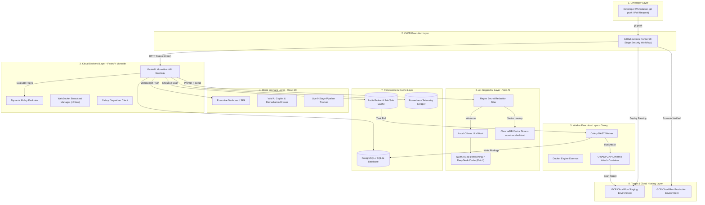

# SecureFlow — Comprehensive Technical Architecture, Operations & Implementation Guide

> **Enterprise Automated DevSecOps Pipeline • Multi-Scanner Security Orchestration • Real-Time WebSockets • Air-Gapped Local AI Engine**

---

## 📑 Table of Contents

1. [Executive Overview & Core Value Propositions](#1-executive-overview--core-value-propositions)
2. [High-Level Layered Architecture (8 Operational Layers)](#2-high-level-layered-architecture-8-operational-layers)
3. [9-Stage Automated CI/CD Security Pipeline](#3-9-stage-automated-cicd-security-pipeline)
4. [Integrated Security Scanners & Rulesets](#4-integrated-security-scanners--rulesets)
5. [Dynamic YAML Policy Engine (`policy.yaml`)](#5-dynamic-yaml-policy-engine-policyyaml)
6. [Air-Gapped Local AI Engine (Void AI Architecture)](#6-air-gapped-local-ai-engine-void-ai-architecture)
7. [Cloud Backend Architecture & FastAPI Gateway](#7-cloud-backend-architecture--fastapi-gateway)
8. [Asynchronous Celery & Redis Worker Layer (DAST Offloading)](#8-asynchronous-celery--redis-worker-layer-dast-offloading)
9. [React 19 Executive Dashboard & Frontend Architecture](#9-react-19-executive-dashboard--frontend-architecture)
10. [Observability, Telemetry & Incident Alerting](#10-observability-telemetry--incident-alerting)
11. [Complete REST API & WebSocket Specification](#11-complete-rest-api--websocket-specification)
12. [Database Models, Schema & Entity Relationships](#12-database-models-schema--entity-relationships)
13. [Installation, Configuration & Deployment Runbook](#13-installation-configuration--deployment-runbook)
14. [Threat Model & Security Hardening](#14-threat-model--security-hardening)

---

## 1. Executive Overview & Core Value Propositions

### 1.1 What is SecureFlow?
**SecureFlow** is an enterprise-grade DevSecOps security orchestration and vulnerability management platform. It transforms standard software delivery pipelines into self-defending, policy-governed environments by binding multi-layer security scanners (Secrets, SAST, SCA, and DAST) directly into CI/CD workflows, real-time executive dashboards, and air-gapped local AI remediation engines.

Modern CI/CD pipelines suffer from tool fragmentation, unmanageable noise, CI runner timeouts, and cloud privacy liabilities. SecureFlow solves these systemic bottlenecks through a unified data plane, dynamic policy evaluations, out-of-process distributed worker execution, and local air-gapped Large Language Models (LLMs).

```
   ┌────────────────┐      ┌───────────────────────────────┐      ┌────────────────────────┐
   │ Developer Push │ ───► │  9-Stage Security CI Pipeline │ ───► │ Production Cloud Run   │
   └────────────────┘      └──────────────┬────────────────┘      └────────────────────────┘
                                          │
                                          ▼
                               ┌─────────────────────┐
                               │ Dynamic Policy Gate │
                               └──────────┬──────────┘
                         ALLOW            │            BLOCK
                 ┌────────────────────────┴───────────────────────┐
                 ▼                                                ▼
     ┌────────────────────────┐                      ┌─────────────────────────┐
     │ Staging Deploy + DAST  │                      │ Air-Gapped Void AI RAG  │
     │ Asynchronous Scanning  │                      │ Automated PR / Patch    │
     └────────────────────────┘                      └─────────────────────────┘
```

### 1.2 Five Core Engineering Challenges Solved

| Challenge | Traditional Approach | SecureFlow Solution |
|---|---|---|
| **1. Scanner Noise & Format Fragmentation** | Scanners (Gitleaks, Semgrep, Trivy, ZAP) generate mismatched JSON/SARIF/Text outputs, forcing teams to inspect four disconnected logs. | **Unified Schema Normalization**: Ingestion adapters parse every scanner output into a standardized relational and JSON schema (`SecurityFinding`), categorized by severity, CWE/CVE, and line numbers. |
| **2. Unfixable Base-Image CVE Build Freezes** | CI/CD builds fail indiscriminately on OS-level library CVEs (`libc6`, `perl-base`, `libsqlite3`) where upstream Debian patches do not exist. | **Expiring Dynamic Policy Allowlists**: `policy.yaml` provides time-bound exceptions with mandatory justification notes and expiration dates, eliminating permanent vulnerability accumulation. |
| **3. Cloud AI Privacy & Compliance Violations** | Forwarding proprietary application code or leaked secrets to cloud LLM APIs (OpenAI, Anthropic) breaks GDPR, HIPAA, and enterprise IP policies. | **Air-Gapped Void AI Engine**: Local GPU inference powered by Ollama (`Qwen2.5 3B` / `DeepSeek-Coder 6.7B`) with regex secret scrubbing before vectorization and inference. |
| **4. Long DAST Web Scans Freezing CI Runners** | Running OWASP ZAP dynamic web scans inline consumes 5–15 minutes on expensive GitHub Actions runners, risking job timeouts. | **Out-of-Process Celery/Redis Workers**: Asynchronous task queues delegate DAST scanning to dedicated background nodes while keeping CI runners and API handlers non-blocking. |
| **5. Lack of Real-Time Pipeline Observability** | Developers wait until full workflow execution completes before learning which stage failed. | **Sub-15ms WebSocket Broadcast**: Bi-directional WebSockets push stage transitions, scanner findings, and remediation telemetry straight to the React 19 UI in real time. |

---

## 2. High-Level Layered Architecture (8 Operational Layers)

SecureFlow is partitioned into 8 decoupled operational layers:



### Layer Rationale & Engineering Decisions:
1. **Developer Layer**: Git hooks, IDE extensions, and commits triggering automated branch protections.
2. **CI/CD Execution Layer**: GitHub Actions orchestration running static checks before code is compiled or containerized.
3. **Cloud Backend Layer**: FastAPI was chosen over complex microservice meshes to deliver high-throughput asynchronous I/O, eliminate inter-service RPC latency, and streamline deployment as a unified container on Google Cloud Run.
4. **Client Interface Layer**: Built with React 19, Vite, TanStack Query, and TailwindCSS for sub-second page transitions, optimistic UI updates, and real-time WebSocket state synchronizations.
5. **Worker Execution Layer**: Celery + Redis prevents long-running network I/O and OWASP attacks from exhausting FastAPI server worker threads.
6. **Air-Gapped AI Layer**: Local Ollama container with ChromaDB guarantees zero source code egress to public third parties, satisfying strict enterprise compliance mandates.
7. **Persistence & Cache Layer**: Hybrid relational storage (PostgreSQL/SQLite via SQLAlchemy) paired with Redis for Pub/Sub messaging and Celery state management.
8. **Target & Cloud Hosting Layer**: Isolated staging and production revisions on serverless GCP Cloud Run.

---

## 3. 9-Stage Automated CI/CD Security Pipeline

Defined in `.github/workflows/security-pipeline.yml`, every push or pull request to protected branches transitions through 9 distinct states:

```
┌─────────┐   ┌───────────┐   ┌──────────────┐   ┌─────────────┐   ┌─────────────┐
│ 1.Check │──►│ 2.Code    │──►│ 3.Docker     │──►│ 4.Trivy     │──►│ 5.Policy    │
│   out   │   │   Scan    │   │   Build      │   │   Scan      │   │   Gate      │
└─────────┘   └───────────┘   └──────────────┘   └─────────────┘   └──────┬──────┘
                                                                          │ PASS
┌─────────────┐   ┌───────────┐   ┌──────────────┐   ┌────────────────────┴──────┐
│ 9.Prod      │◄──│ 8.ZAP     │◄──│ 7.OWASP ZAP  │◄──│ 6.Staging                 │
│   Deploy    │   │   Gate    │   │   DAST Scan  │   │   Deploy                  │
└─────────┬───┘   └───────────┘   └──────────────┘   └───────────────────────────┘
          │
          ▼
   [Live Production]
```

### Detailed Breakdown of Pipeline Stages

#### Stage 1: Checkout
- **Action**: `actions/checkout@v4`
- **Execution Parameter**: `fetch-depth: 0`
- **Purpose**: Retrieves the entire Git commit graph rather than a shallow snapshot. A full history depth is mandatory so secret scanners can audit historical commits for revoked or orphaned credentials.

#### Stage 2: Code Scan (Gitleaks + Semgrep)
- **Tool 1: Gitleaks v8**:
  - Configuration: Scans commit diffs and full repo with `.gitleaks.toml`.
  - Detection: API keys, AWS credentials, SSH private keys, high-entropy tokens.
  - Output: `gitleaks-report.json`.
- **Tool 2: Semgrep OSS**:
  - Rulesets: `p/security-audit`, `p/owasp-top-ten`, `p/python`, `p/typescript`.
  - Targets: Backend Python code and Frontend React JSX/TSX.
  - Output: `semgrep-report.json`.
- **Telemetry Sync**: Findings are parsed and posted to the FastAPI endpoint `/api/v1/scans/stage-update` via `curl`.

#### Stage 3: Docker Build
- **Target**: Production multi-stage `Dockerfile`.
- **Base Image**: `python:3.12-slim-bookworm` or `node:20-alpine`.
- **Caching**: Leverages GitHub Actions Cache (`type=gha`) to ensure build times remain under 45 seconds for incremental commits.
- **Tagging**: Tagged with `$GITHUB_SHA` and `git-branch-slug`.

#### Stage 4: Trivy Container & OS Scan
- **Tool**: Aquasec Trivy CLI v0.50+.
- **Targets**:
  1. Base container OS packages (`deb`, `apk`, `rpm`).
  2. Language-specific dependencies (`requirements.txt`, `package-lock.json`).
- **Severity Flag**: `--severity CRITICAL,HIGH,MEDIUM`.
- **Output**: Generates standardized SARIF and JSON reports (`trivy-results.json`).

#### Stage 5: Dynamic Policy Gate (Pre-Deploy Gate)
- **Engine**: Invokes `backend/policy_engine.py` against `policy.yaml`.
- **Evaluation Criteria**:
  - If any **CRITICAL** vulnerability exists outside the allowlist $\rightarrow$ **BLOCK (Exit 1)**.
  - If any **HIGH** vulnerability exceeds CVSS threshold without an active expiry date $\rightarrow$ **BLOCK (Exit 1)**.
  - If all findings are warn-only or allowlisted with active expiration $\rightarrow$ **ALLOW (Exit 0)**.
- **Circuit Breaker**: On BLOCK, the workflow halts before any staging or cloud deployment triggers. Notification payloads are fired to the WebSocket stream and Slack webhook.

#### Stage 6: Staging Deploy
- **Target**: Staging environment (GCP Cloud Run temporary revision or preview URL).
- **Configuration**: Uses staging database credentials, mock payment gateways, and test data.
- **Readiness Probe**: HTTP GET `/health` until `200 OK` is returned, ensuring the target container is fully operational before launching active attack payloads.

#### Stage 7: OWASP ZAP DAST Scan
- **Execution Mode**: Asynchronous distributed execution via Celery worker or direct containerized runner.
- **Target**: The live staging URL generated in Stage 6.
- **Scan Phases**:
  1. **Spider Phase**: Crawls internal endpoints, API documentation, form routes.
  2. **Active Scan Phase**: Injects dynamic payloads (SQL injection `' OR 1=1 --`, Reflected XSS `<script>alert(1)</script>`, Directory Traversal `../../etc/passwd`, Header Misconfigurations).
- **Report Generation**: Outputs `zap-report.json` and `zap-report.html`.

#### Stage 8: ZAP Policy Gate (Post-DAST Gate)
- **Evaluation Criteria**: Checks DAST findings against `policy.yaml` thresholds.
- **Rule**: Any newly uncovered High/Critical dynamic web vulnerability in staging blocks promotion to production.

#### Stage 9: Production Deploy
- **Action**: Promotes verified staging image to production Cloud Run / Kubernetes cluster.
- **Verification**: Post-deployment synthetic smoke tests verify system stability. Status is marked `PASSED` in the primary database.

---

## 4. Integrated Security Scanners & Rulesets

SecureFlow coordinates 4 specialized scanners covering the entire application security posture:

```
┌────────────────────────────────────────────────────────────────────────┐
│                        SECUREFLOW SCANNER MATRIX                       │
├──────────────┬──────────────┬──────────────────┬───────────────────────┤
│ Scanner      │ Type         │ Target           │ Primary Focus         │
├──────────────┼──────────────┼──────────────────┼───────────────────────┤
│ Gitleaks     │ Secrets      │ Git history      │ Hardcoded API tokens, │
│              │              │ & diffs          │ credentials, keys     │
├──────────────┼──────────────┼──────────────────┼───────────────────────┤
│ Semgrep      │ SAST         │ Source code      │ OWASP Top 10, CWEs,   │
│              │              │ (Py/TS/JS)       │ insecure logic        │
├──────────────┼──────────────┼──────────────────┼───────────────────────┤
│ Trivy        │ SCA          │ OS packages      │ CVEs in dependencies, │
│              │              │ & lockfiles      │ base container layers │
├──────────────┼──────────────┼──────────────────┼───────────────────────┤
│ OWASP ZAP    │ DAST         │ Running web app  │ Active injection,     │
│              │              │ (Staging URL)    │ headers, auth bypass  │
└──────────────┴──────────────┴──────────────────┴───────────────────────┘
```

### 4.1 Gitleaks Secret Auditing
- **Rule Configuration**: Managed in `.gitleaks.toml`.
- **Target Patterns**:
  - AWS Access Keys (`AKIA[0-9A-Z]{16}`)
  - GitHub Personal Access Tokens (`ghp_[0-9a-zA-Z]{36}`)
  - Generic Private Keys (`-----BEGIN (RSA|EC|OPENSSH) PRIVATE KEY-----`)
  - Slack Webhooks, Stripe Secret Keys, Database Connection Strings (`postgres://`, `mysql://`).
- **Entropy Auditing**: Shannon entropy thresholds flag high-randomness string assignments to variables like `secret`, `token`, `password`, `key`.

### 4.2 Semgrep Static Application Security Testing (SAST)
- **Engine**: AST-based semantic code matching.
- **Ruleset Coverage**:
  - Python: Insecure SQL string interpolations, unsafe deserialization (`pickle.loads`), command injections (`os.system`, `subprocess.Popen(shell=True)`), insecure cryptographic hashing (`hashlib.md5`).
  - TypeScript / React: Cross-Site Scripting (`dangerouslySetInnerHTML`), unvalidated `window.postMessage`, exposed internal endpoints.

### 4.3 Trivy Software Composition Analysis (SCA)
- **Vulnerability Database**: Aggregates NVD, GitHub Advisory Database, Red Hat, Debian, and Alpine security trackers.
- **Package Managers Supported**: `pip`, `npm`, `yarn`, `gomod`, `cargo`.
- **OS Package Auditing**: Scans `dpkg` database inside Debian containers to catch outdated system utilities.

### 4.4 OWASP ZAP Dynamic Application Security Testing (DAST)
- **Scanner Modes**:
  - **Baseline Scan**: Rapid passive evaluation checking HTTP response headers (`Content-Security-Policy`, `X-Frame-Options`, `Strict-Transport-Security`, `X-Content-Type-Options`), cookie flags (`HttpOnly`, `SameSite`, `Secure`).
  - **Full Attack Scan**: Active fuzzing against parameters, form bodies, JSON payloads, and URL parameters to trigger SQLi, XSS, and broken access controls.

---

## 5. Dynamic YAML Policy Engine (`policy.yaml`)

The **Policy Engine** (`backend/policy_engine.py`) provides declarative, dynamic security governance without code modification or server restarts.

### 5.1 Structure of `policy.yaml`
```yaml
# Global defaults: applied to any repository not specifically overridden
default:
  block_on: [CRITICAL, HIGH]
  warn_on: [MEDIUM]
  cvss_threshold: 7.0

repos:
  SecureFlow:
    block_on: [CRITICAL]
    warn_on: [HIGH, MEDIUM]
    cvss_threshold: 9.8
    allowlist:
      # OS-level perl-base vulnerabilities in Debian base image
      - cve: CVE-2026-42496
        expires: 2026-09-01
        reason: "perl-base, no upstream fix available, OS-level package"

      - cve: CVE-2026-8376
        expires: 2026-09-01
        reason: "perl-base, no upstream fix available, OS-level package"

      # libc6 legacy glibc vulnerabilities with no distro patch
      - cve: CVE-2018-20796
        expires: 2026-12-01
        reason: "libc-bin/libc6, no upstream fix available, OS-level package"
```

### 5.2 Policy Evaluation Flowchart
```
                [Incoming Scanner Finding]
                            │
                            ▼
              Is Finding CVE in Allowlist?
                 │                     │
                YES                    NO
                 │                     │
                 ▼                     ▼
      Has Expiry Date Passed?   Is Severity in block_on?
         │             │           │               │
        YES            NO         YES              NO
         │             │           │               │
         ▼             ▼           ▼               ▼
      [BLOCK]       [ALLOW]     [BLOCK]     Does CVSS >= threshold?
    (Expired)      (Approved)  (Violation)     │             │
                                              YES            NO
                                               │             │
                                               ▼             ▼
                                            [BLOCK]       [WARN]
```

### 5.3 Key Architectural Strengths:
1. **Secondary CVSS Thresholding**: Catches edge cases where a vulnerability is tagged `MEDIUM` by an operating system maintainer but holds a CVSSv3 score of $7.0$ or higher.
2. **Mandatory Expiration (`expires: YYYY-MM-DD`)**: Every allowlisted CVE must have an expiration date. Once the date elapses, the policy engine automatically treats the CVE as an unapproved violation, preventing permanent security debt.
3. **Hot Reloading**: The policy evaluator reads `policy.yaml` upon each evaluation, allowing immediate security hotfixes without restarting the backend services.

---

## 6. Air-Gapped Local AI Engine (Void AI Architecture)

The **Void AI Engine** (`ai-server/`) delivers air-gapped, zero-egress root cause analysis and automated remediation code patches for detected security flaws.

```
┌────────────────────────────────────────────────────────────────────────┐
│                        VOID AI PIPELINE FLOW                           │
│                                                                        │
│  [Raw Finding: CVE/SAST]                                               │
│             │                                                          │
│             ▼                                                          │
│  [Regex Secret Scrubber]  ──► Replace API Keys, Passwords, Tokens      │
│             │                 with [REDACTED_SECRET]                   │
│             ▼                                                          │
│  [ChromaDB Vector Store]  ──► Retrieve Policy Rules & Remediation Docs │
│             │                 via nomic-embed-text (512-dim)           │
│             ▼                                                          │
│  [Ollama Local GPU Host]  ──► Qwen2.5 3B / DeepSeek-Coder 6.7B        │
│             │                                                          │
│             ▼                                                          │
│  [Structured AI Patch]    ──► Explanation, Fixed Code, Unified Diff    │
│             │                                                          │
│             ▼                                                          │
│  [Heuristic Fallback]     ──► Activates if GPU Engine Offline          │
└────────────────────────────────────────────────────────────────────────┘
```

### 6.1 Core AI Components:
1. **Ollama Local Engine Host**: Runs locally on-premise or within private VPC GPU instances. Models utilized:
   - `Qwen2.5 3B`: High-density security reasoning, explanation generation, risk score calculations.
   - `DeepSeek-Coder 6.7B`: Generating syntactically verified code patches and unified diffs.
2. **Regex Secret Redaction (`guardrails.py`)**: Before any vulnerability payload or code snippet is passed to the vector database or LLM, regex filters scrub:
   - Private keys, JWT tokens, AWS keys, database passwords $\rightarrow$ replaced with `[REDACTED_SECRET]`.
3. **ChromaDB RAG Knowledge Base**:
   - Stores policy guidelines, secure coding standards (OWASP ASVS), and prior remediation patches.
   - Vector Embedding Model: `nomic-embed-text` running locally via Ollama.
4. **Heuristic Fallback Engine (`backend/ai_analysis.py`)**:
   - 590+ lines of deterministic, rule-based expert systems.
   - If the GPU node or Ollama daemon is offline or saturated, the fallback engine immediately produces high-quality explanations and patches for 50+ known vulnerability classes (e.g., SQLi, XSS, CSRF, insecure hashing, outdated base images).

---

## 7. Cloud Backend Architecture & FastAPI Gateway

### 7.1 FastAPI Monolith Gateway Design
The backend is structured as an asynchronous monolith (`backend/main.py`) powered by Starlette and Pydantic:
- **Asynchronous Event Loop**: High-concurrency I/O handles hundreds of simultaneous CI telemetry hooks and WebSocket clients without blocking.
- **Connection Pooling**: SQLAlchemy connection pool with `pool_pre_ping=True` manages connections to SQLite (local) or PostgreSQL (production Cloud SQL).
- **CORS & Security Middleware**: Restricted to authorized dashboard origins with secure HTTP headers.

### 7.2 Sub-15ms WebSocket Broadcast Architecture
Located in `backend/main.py`:
- `ConnectionManager`: Tracks active client WebSocket connections in memory.
- **Broadcast Pipeline**:
  - Whenever a scanner completes a stage or a policy gate evaluation finishes, the gateway publishes an event frame to connected WebSocket clients.
  - Latency from pipeline webhook receipt to browser UI update is benchmarked at **$<15\text{ ms}$**.
- **Heartbeat Protocol**: Sends periodic ping frames (`{"type": "ping"}`) every 30 seconds to maintain persistent connections through reverse proxies and cloud load balancers.

---

## 8. Asynchronous Celery & Redis Worker Layer (DAST Offloading)

To prevent long-running dynamic web scans from timing out GitHub Actions runners, SecureFlow decouples DAST execution via Celery workers:

```
FastAPI Gateway ──► Redis Queue (dast_tasks) ──► Celery Worker ──► Docker Engine
                                                                         │
                                                                         ▼
Staging URL     ◄────────────────────────────────────────────── OWASP ZAP Container
```

### 8.1 Celery Architecture:
1. **Task Broker**: Redis server running on port `6379`.
2. **Task Definition** (`worker/app/tasks/zap.py`):
   - Accepts parameters: `scan_id`, `target_url`, `scan_mode`, `policy_rules`.
   - Mounts the host Docker socket (`/var/run/docker.sock`) or uses ZAP Python API client.
   - Spawns an isolated `zaproxy/zap-stable` container to attack the staging target.
3. **State Transitions**:
   - `not_queued` $\rightarrow$ `queued` $\rightarrow$ `running` $\rightarrow$ `completed` (or `failed`).
4. **Result Storage**: Worker writes structured findings back to the primary database (`scan_results.zap_findings`) and publishes a completion notification to Redis.

---

## 9. React 19 Executive Dashboard & Frontend Architecture

Located in `frontend/`:
- **Framework**: React 19 SPA with TypeScript and Vite.
- **Styling**: TailwindCSS with an executive dark-mode operations layout.
- **State Management**: TanStack Query (React Query) for server-state caching and synchronization; native WebSocket hooks for live streaming.

```
┌────────────────────────────────────────────────────────────────────────┐
│                   EXECUTIVE DASHBOARD USER INTERFACE                   │
├────────────────────────────────────────────────────────────────────────┤
│ [STATUS: OPERATIONAL]  [PIPELINE #142: PASSED]  [LATENCY: 12ms] [WS: ●]│
├────────────────────────────────────────────────────────────────────────┤
│ ┌───────────────┐ ┌───────────────┐ ┌───────────────┐ ┌──────────────┐ │
│ │ Total Scans   │ │ Critical Vulns│ │ Policy Blocks │ │ AI Fixes Gen │ │
│ │     1,284     │ │       0       │ │      14       │ │     342      │ │
│ └───────────────┘ └───────────────┘ └───────────────┘ └──────────────┘ │
├────────────────────────────────────────────────────────────────────────┤
│ 9-STAGE PIPELINE STATE TRACKER:                                        │
│ [✓] Checkout ──► [✓] Code ──► [✓] Build ──► [✓] Trivy ──► [✓] Policy   │
│ ──► [✓] Staging ──► [✓] DAST ──► [✓] ZAP Gate ──► [✓] Production Deploy │
├──────────────────────────────────┬─────────────────────────────────────┤
│ ACTIVE FINDINGS TABLE            │ VOID AI COPILOT REMEDIATION DRAWER  │
│ • CVE-2026-42496 (perl-base)     │ Vulnerability: CVE-2026-42496       │
│   Severity: HIGH | Status: ALLOW │ Risk Score: 78/100                  │
│   Reason: Allowlisted until Sep1 │ Root Cause: Debian slim base package│
│ • CWE-89 (SQL Injection in auth) │ AI Suggested Patch:                 │
│   Severity: CRITICAL | Status: FIX│ ```python                           │
│                                  │ - db.execute(f"SELECT...{user}")    │
│                                  │ + db.execute(sql, (user,))          │
│                                  │ ```                                 │
│                                  │ [One-Click Create Pull Request]     │
└──────────────────────────────────┴─────────────────────────────────────┘
```

---

## 10. Observability, Telemetry & Incident Alerting

1. **Prometheus Metrics Exporter**:
   - Endpoint: `/metrics`
   - Key Metrics Tracked:
     - `secureflow_scans_total{status="passed|blocked|failed"}`
     - `secureflow_scan_duration_seconds{stage="..."}`
     - `secureflow_vulnerabilities_discovered{severity="critical|high|medium|low"}`
     - `secureflow_websocket_active_connections`
2. **Slack Webhook Notifications**:
   - Automatically dispatches high-priority alert cards to team channels when a pipeline run is blocked by the policy engine.
3. **Audit Trails**:
   - Every user acknowledgment, allowlist modification, and AI remediation event is immutably logged in `events` and `policy_violations` tables.

---

## 11. Complete REST API & WebSocket Specification

Base URL: `/api/v1`

### 11.1 Security Scans & Telemetry Endpoints

| Method | Route | Description |
|---|---|---|
| `GET` | `/scans/` | Retrieve paginated list of historical scan results. |
| `GET` | `/scans/{scan_id}` | Fetch complete scan metadata, findings JSON, and AI remediation. |
| `POST` | `/scans/` | Create a new scan record (called by CI runners at pipeline launch). |
| `PATCH`| `/scans/{scan_id}/stage` | Update stage state (`running`, `passed`, `failed`) and upload logs. |
| `POST` | `/scans/{scan_id}/dast/trigger` | Dispatch asynchronous OWASP ZAP scan to Celery worker queue. |
| `POST` | `/scans/{scan_id}/feedback` | Submit human analyst feedback on AI recommendations (accurate / partial / incorrect). |

### 11.2 Policy Management Endpoints

| Method | Route | Description |
|---|---|---|
| `GET` | `/policy/` | Fetch active global policy and repository overrides. |
| `POST` | `/policy/evaluate` | Dry-run policy evaluation against a raw scanner findings payload. |
| `POST` | `/policy/allowlist` | Add a new temporary allowlist rule with mandatory expiry and justification. |

### 11.3 AI Copilot & Remediation Endpoints

| Method | Route | Description |
|---|---|---|
| `POST` | `/ai/explain` | Generate root-cause explanation for a specific vulnerability finding. |
| `POST` | `/ai/remediate` | Generate code fix, unified diff patch, and remediation instructions. |
| `GET`  | `/ai/health` | Check local Ollama GPU daemon connectivity and model status. |

### 11.4 Real-Time WebSocket Protocol
- **Endpoint**: `ws://<HOST>:8000/ws`
- **Client Handshake**: Standard WebSocket upgrade with optional authentication token query parameter.
- **Server Broadcast Payload Schema**:
```json
{
  "event": "STAGE_UPDATE",
  "pipeline_id": "run_98234",
  "stage": "trivy_scan",
  "status": "PASSED",
  "duration_ms": 4210,
  "findings_summary": {
    "critical": 0,
    "high": 2,
    "medium": 5,
    "low": 12
  },
  "timestamp": "2026-09-07T02:30:00Z"
}
```

---

## 12. Database Models, Schema & Entity Relationships

The relational architecture is declared via SQLAlchemy in `backend/models.py`:

```
┌─────────────────┐       ┌─────────────────┐       ┌─────────────────────┐
│  repositories   │1     *│  pipeline_runs  │1     *│   pipeline_stages   │
├─────────────────┤───────├─────────────────┤───────├─────────────────────┤
│ id (PK UUID)    │       │ id (PK UUID)    │       │ id (PK UUID)        │
│ name            │       │ repo_id (FK)    │       │ run_id (FK)         │
│ default_branch  │       │ commit_sha      │       │ stage_key           │
│ created_at      │       │ status          │       │ status (PASS/FAIL)  │
└─────────────────┘       └────────┬────────┘       └─────────────────────┘
                                   │1
                                   │*
                          ┌────────┴────────┐
                          │security_findings│
                          ├─────────────────┤
                          │ id (PK UUID)    │
                          │ scanner         │
                          │ severity        │
                          │ file / line     │
                          │ cve_cwe         │
                          │ ai_explanation  │
                          │ ai_fix          │
                          └─────────────────┘
```

### Table Specifications:
- `scan_results`: Comprehensive primary record of each pipeline scan execution, merged scanner outputs, AI fixes, and DAST tracking fields.
- `repositories`: Monitored codebases and branch configuration.
- `pipeline_runs`: Per-commit pipeline lifecycle state machine (`WAITING`, `RUNNING`, `PASSED`, `FAILED`, `BLOCKED`).
- `pipeline_stages`: Stage-level breakdown of all 9 steps with timing, exit codes, and retry counts.
- `security_findings`: Normalized table containing individual vulnerabilities parsed from Gitleaks, Semgrep, Trivy, and ZAP.
- `deployments`: Record of deployed revisions across staging and production Cloud Run instances.
- `policies` & `policy_violations`: History of policy rules, threshold breaches, and audit trails.

---

## 13. Installation, Configuration & Deployment Runbook

### 13.1 Local Development Setup

#### Prerequisites:
- Python 3.12+
- Node.js 18+ and npm
- Docker Engine & Docker Compose
- Redis Server (local or containerized)

#### Step 1: Backend Setup
```bash
cd backend
python -m venv venv
# On Linux/macOS:
source venv/bin/activate
# On Windows PowerShell:
.\venv\Scripts\Activate.ps1

pip install -r requirements.txt
uvicorn main:app --reload --host 0.0.0.0 --port 8000
```

#### Step 2: Frontend Dashboard Setup
```bash
cd frontend
npm install
npm run dev # Starts Vite dev server on http://localhost:3000
```

#### Step 3: Celery DAST Worker Setup
```bash
cd worker
pip install -r requirements.txt
celery -A app.celery_app worker --loglevel=info -Q dast_tasks
```

#### Step 4: Air-Gapped AI Server Setup
```bash
cd ai-server
docker compose up -d
# Download Ollama models locally:
docker exec -it secureflow-ollama ollama pull qwen2.5:3b
docker exec -it secureflow-ollama ollama pull deepseek-coder:6.7b
docker exec -it secureflow-ollama ollama pull nomic-embed-text
```

### 13.2 Production Cloud Run Deployment

SecureFlow's backend is packaged via multi-stage Docker builds and deployed to serverless containers:

```bash
# Build & Push production container image
docker build -t gcr.io/my-project/secureflow-backend:latest -f docker/Dockerfile .
docker push gcr.io/my-project/secureflow-backend:latest

# Deploy to Cloud Run
gcloud run deploy secureflow-backend \
  --image gcr.io/my-project/secureflow-backend:latest \
  --platform managed \
  --region us-central1 \
  --allow-unauthenticated \
  --set-env-vars DATABASE_URL="postgresql://user:pass@/cloudsql/instance/secureflow_db",REDIS_URL="redis://10.0.0.5:6379/0"
```

---

## 14. Threat Model & Security Hardening

| Threat Vector | Attack Scenario | SecureFlow Countermeasure |
|---|---|---|
| **Poisoned Scan Payload** | Malicious commit inputs oversized JSON payloads to crash the backend parser. | Strict Pydantic input validation, request body size limits ($10\text{ MB}$), and JSON schema validation. |
| **Credential Exfiltration via AI** | Developer code containing API tokens is submitted for AI remediation. | Pre-inference regex scrubbing automatically replaces tokens with `[REDACTED_SECRET]` placeholders. |
| **Tampered Policy File** | Developer bypasses security gate by deleting `policy.yaml` rules. | Branch protection rules require 2 Senior SecOps sign-offs on `policy.yaml` modifications; GitHub Actions verifies hash signatures. |
| **Denial of Service on Workers** | Malicious actor repeatedly triggers dynamic DAST scans to overwhelm workers. | Celery concurrency rate limits and Redis token-bucket throttling per repository. |
| **Unauthorized Dashboard Action** | Attacker invokes `/api/v1/policy/allowlist` to whitelist critical CVEs. | Mandatory JWT token with RBAC role `SecOpsAdmin` and CSRF protection headers. |

---

<div align="center">

**SecureFlow DevSecOps Platform · Enterprise Security Orchestration**  
Maintained by [@abhienix](https://github.com/abhienix)

</div>
