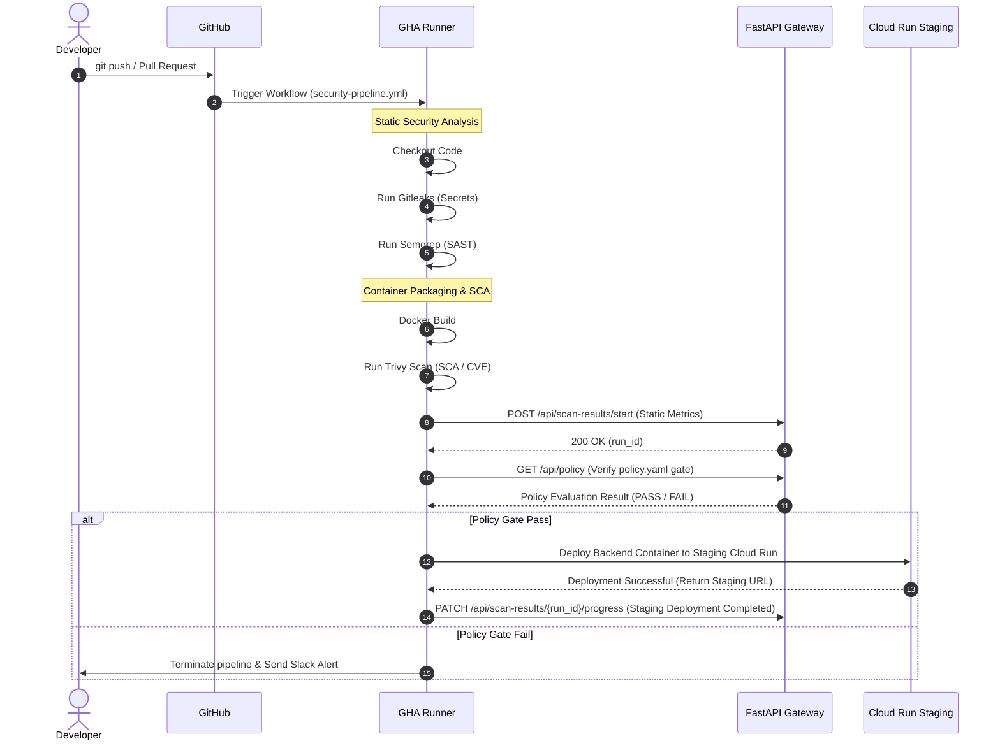
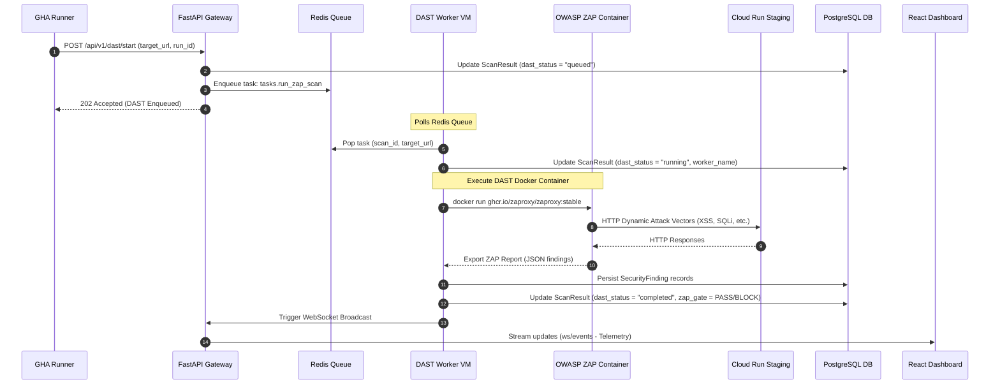
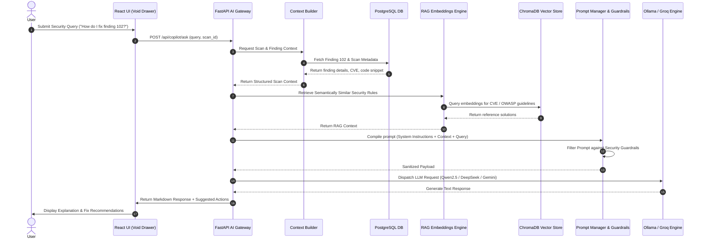
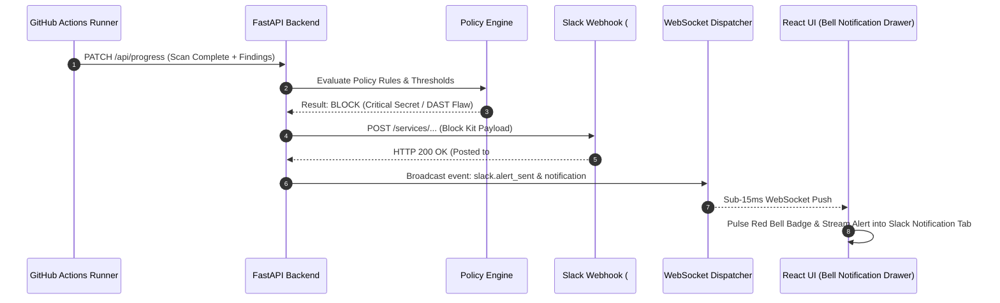
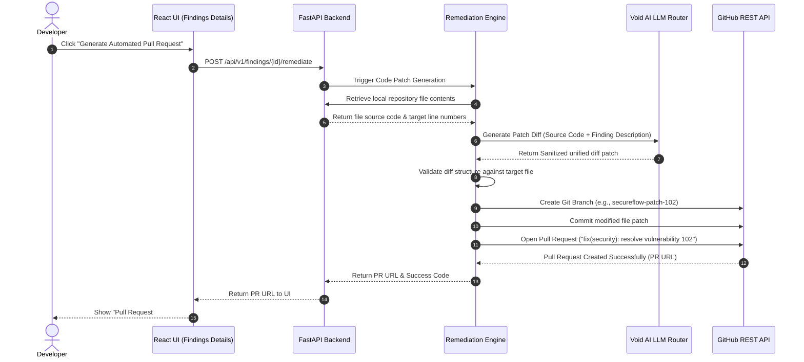

# SecureFlow 2.0 — Enterprise Architecture Specifications

This document defines the production-grade, layered system architecture of the SecureFlow DevSecOps platform, detailing the operational layers, communications protocols, and transaction sequences.

---

## 1. High-Level Layered Architecture

This diagram maps the platform components into 8 horizontal operational layers:

```mermaid
%%{init: {'theme': 'neutral', 'themeVariables': { 'background': '#ffffff', 'primaryColor': '#ffffff', 'primaryTextColor': '#000000', 'primaryBorderColor': '#000000', 'lineColor': '#333333'}}}%%
flowchart TD
    classDef default fill:#ffffff,stroke:#0f172a,stroke-width:1px,color:#000000;

    %% ----------------------------------------------------
    %% Layers Definitions
    %% ----------------------------------------------------
    subgraph Dev_Layer [💻 Developer Layer]
        dev[Developer Workstation]
    end

    subgraph CICD_Layer [⚙️ CI/CD Execution Layer]
        github[GitHub Repository]
        subgraph GHA_Pipeline [GitHub Actions Runner]
            c1[Checkout] --> c2[Gitleaks] --> c3[Semgrep] --> c4[Docker Build] --> c5[Trivy] --> c6[Policy Engine] --> c7[Deploy Staging] --> c8[Trigger DAST] --> c9[Deploy Production]
        end
    end

    subgraph Client_Layer [📊 Client Interface Layer]
        dashboard[React Executive Dashboard]
        void_drawer[Void AI Copilot Drawer]
        console[Admin Management Console]
        notifs[Notification Center]
    end

    subgraph Backend_Layer [⚡ Cloud Backend Layer - API Gateway & Services]
        gateway[API Gateway / Auth Router]
        repo_svc[Repository Service]
        pipe_svc[Pipeline Service]
        find_svc[Findings Service]
        dep_svc[Deployment Service]
        pol_svc[Policy Evaluator]
        ai_gtw[AI Gateway]
        obs_svc[Observability Service]
        ws_mgr[WebSocket Manager]
        
        gateway --> repo_svc
        gateway --> pipe_svc
        gateway --> find_svc
        gateway --> dep_svc
        gateway --> pol_svc
        gateway --> ai_gtw
        gateway --> obs_svc
        gateway --> ws_mgr
    end

    subgraph AI_Layer [🧠 AI Intelligence Layer]
        conv_mgr[Conversation Manager]
        ctx_bld[Context Builder RAG]
        rag_eng[RAG Embeddings Engine]
        mcp_srv[MCP Server Context]
        guardrails[Guardrails & Safety Filters]
        prompt_mgr[Prompt Manager]
        ollama[Ollama Engine Host]
        qwen[Qwen2.5 3B Model]
        nomic[nomic-embed-text]
        chroma[ChromaDB Vector Store]
        remedy[Remediation Engine]

        ai_gtw --> conv_mgr
        conv_mgr --> ctx_bld
        ctx_bld --> rag_eng
        rag_eng --> mcp_srv
        mcp_srv --> prompt_mgr
        prompt_mgr --> guardrails
        guardrails --> ollama
        ollama --> qwen
        ollama --> nomic
        rag_eng --> chroma
        ctx_bld --> remedy
    end

    subgraph Data_Layer [🗄️ Databases & Cache Layer]
        pg[(PostgreSQL DB)]
        redis[Redis Queue & PubSub]
        prom[(Prometheus Server)]
    end

    subgraph Worker_Layer [🖥️ Worker Execution Layer]
        celery[Celery Task Consumer]
        docker[Docker Engine Socket]
        zap[OWASP ZAP Container]
        health[Worker Health Agent]
        heartbeat[Heartbeat Service]

        celery --> docker
        docker --> zap
        health --> heartbeat
    end

    subgraph Ext_Layer [🌐 External Integrations Layer]
        github_api[GitHub REST API]
        slack[Slack Webhook App]
        staging_env[Cloud Run Staging]
        prod_env[Cloud Run Production]
    end

    %% ----------------------------------------------------
    %% Communication & Flows Between Layers
    %% ----------------------------------------------------
    dev ==>|1. git push / PR| github
    github -->|2. Trigger| GHA_Pipeline
    
    %% CI progress to Backend (HTTP Sync)
    GHA_Pipeline -->|3. HTTP Progress PATCH| gateway
    
    %% Deployments to Cloud Run
    c7 -->|Deploy Image| staging_env
    c9 -->|Deploy Image| prod_env

    %% Client Dashboard connections
    dashboard ==>|HTTP REST Calls| gateway
    void_drawer ==>|HTTP REST Calls| gateway
    console ==>|HTTP REST Calls| gateway
    notifs ==>|HTTP REST Calls| gateway
    gateway -.->|Sub-15ms WebSocket push| dashboard

    %% Backend Data Access
    repo_svc ==>|SQL Queries| pg
    pipe_svc ==>|SQL Queries| pg
    find_svc ==>|SQL Queries| pg
    dep_svc ==>|SQL Queries| pg
    pol_svc ==>|SQL Queries| pg
    obs_svc ==>|SQL Queries| pg
    
    pipe_svc -.->|Enqueue DAST / Cache| redis
    dep_svc -.->|Enqueue DAST / Cache| redis
    obs_svc -.->|Scrape Metrics| prom

    %% Worker DAST Flow (Out of process)
    redis -.->|DAST Task Queue| celery
    zap -->|Attack Scan Target| staging_env
    celery ==>|Persist Findings| pg
    heartbeat -.->|Worker Heartbeat| redis

    %% AI Integrations
    ctx_bld ==>|Read DB Findings| pg
    remedy -.->|Create Pull Requests| github_api
    obs_svc -.->|Send Slack Alerts| slack

    %% Subgraph Styling
    style Dev_Layer fill:#f8fafc,stroke:#334155,stroke-width:2px,stroke-dasharray:5 5
    style CICD_Layer fill:#f8fafc,stroke:#334155,stroke-width:2px,stroke-dasharray:5 5
    style Client_Layer fill:#f8fafc,stroke:#334155,stroke-width:2px,stroke-dasharray:5 5
    style Backend_Layer fill:#f8fafc,stroke:#334155,stroke-width:2px,stroke-dasharray:5 5
    style AI_Layer fill:#f8fafc,stroke:#334155,stroke-width:2px,stroke-dasharray:5 5
    style Data_Layer fill:#f8fafc,stroke:#334155,stroke-width:2px,stroke-dasharray:5 5
    style Worker_Layer fill:#f8fafc,stroke:#334155,stroke-width:2px,stroke-dasharray:5 5
    style Ext_Layer fill:#f8fafc,stroke:#334155,stroke-width:2px,stroke-dasharray:5 5
```

---

## 2. Sequence Diagrams

### CI/CD Workflow Sequence
This sequence diagram maps the progression of the GitHub Actions pipeline:

### Asynchronous DAST Workflow Sequence
This diagram details the sequence for the asynchronous, out-of-process DAST worker scanning lifecycle:

### Void AI Copilot Request Flow Sequence
All Void AI Copilot requests are routed through the secure FastAPI AI Gateway:

### Slack Incident Notification Sequence Flow
This sequence shows automated Slack Block Kit dispatch and real-time Notification Center synchronization:

### Automated Code Remediation Sequence
This sequence shows the path for automated code remediation:

