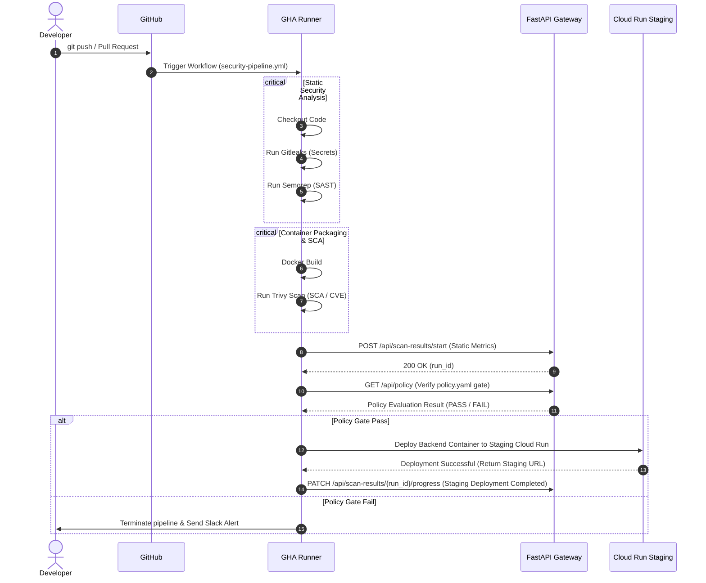
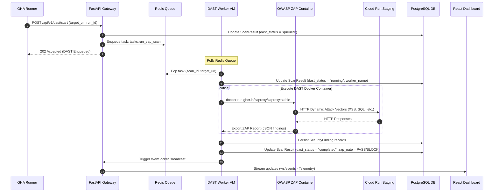
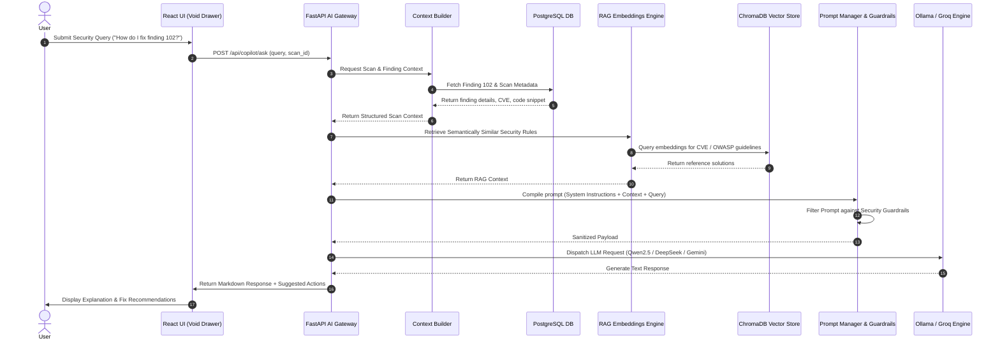
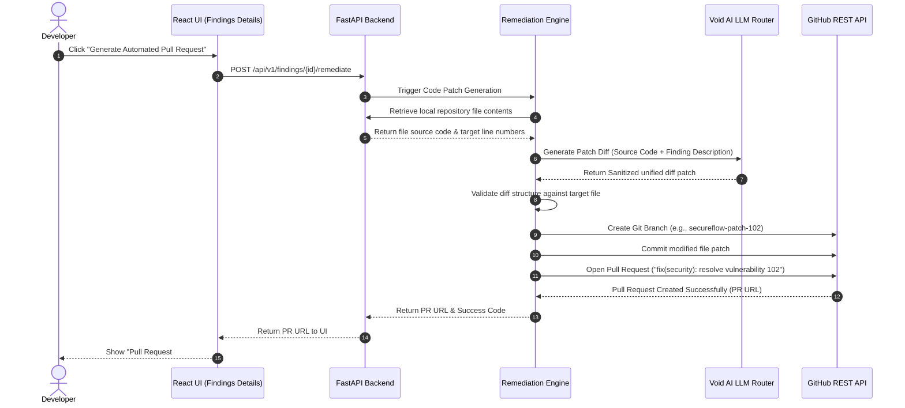

# SecureFlow 2.0 — Enterprise Architecture Specifications

This document defines the production-grade, fault-tolerant system architecture of the SecureFlow DevSecOps platform. It organizes the system into horizontal operational layers and maps the interactions, protocols, and data flows between components.

---

## 1. High-Level Architecture Diagram (Layered)

This diagram organizes SecureFlow into 8 horizontal layers using clean, uncoloured, whiteboard-style Mermaid formatting. It separates synchronous HTTP (solid lines), asynchronous queue operations (dotted lines), database queries (thick lines), and telemetry (dashed lines).

```mermaid
%%{init: {'theme': 'neutral', 'themeVariables': { 'background': '#ffffff', 'primaryColor': '#ffffff', 'primaryTextColor': '#000000', 'primaryBorderColor': '#000000', 'lineColor': '#333333'}}}%%
flowchart TD
    classDef layer fill:#f8fafc,stroke:#334155,stroke-width:2px,stroke-dasharray: 5 5;
    classDef service fill:#ffffff,stroke:#0f172a,stroke-width:1px;

    %% ----------------------------------------------------
    %% Layers Definitions
    %% ----------------------------------------------------
    subgraph Dev_Layer [💻 Developer Layer]
        dev[Developer Workstation]:::service
    end
    class Dev_Layer layer;

    subgraph CICD_Layer [⚙️ CI/CD Execution Layer]
        github[GitHub Repository]:::service
        subgraph GHA_Pipeline [GitHub Actions Runner]
            c1[Checkout] --> c2[Gitleaks] --> c3[Semgrep] --> c4[Docker Build] --> c5[Trivy] --> c6[Policy Engine] --> c7[Deploy Staging] --> c8[Trigger DAST] --> c9[Deploy Production]
        end
    end
    class CICD_Layer layer;

    subgraph Client_Layer [📊 Client Interface Layer]
        dashboard[React Executive Dashboard]:::service
        void_drawer[Void AI Copilot Drawer]:::service
        console[Admin Management Console]:::service
        notifs[Notification Center]:::service
    end
    class Client_Layer layer;

    subgraph Backend_Layer [⚡ Cloud Backend Layer - API Gateway & Internal Services]
        gateway[API Gateway / Auth Router]:::service
        repo_svc[Repository Service]:::service
        pipe_svc[Pipeline Service]:::service
        find_svc[Findings Service]:::service
        dep_svc[Deployment Service]:::service
        pol_svc[Policy Evaluator]:::service
        ai_gtw[AI Gateway]:::service
        obs_svc[Observability Service]:::service
        ws_mgr[WebSocket Manager]:::service
        
        gateway --> repo_svc & pipe_svc & find_svc & dep_svc & pol_svc & ai_gtw & obs_svc & ws_mgr
    end
    class Backend_Layer layer;

    subgraph AI_Layer [🧠 AI Intelligence Layer]
        conv_mgr[Conversation Manager]:::service
        ctx_bld[Context Builder RAG]:::service
        rag_eng[RAG Embeddings Engine]:::service
        mcp_srv[MCP Server Context]:::service
        guardrails[Guardrails & Safety Filters]:::service
        prompt_mgr[Prompt Manager]:::service
        ollama[Ollama Engine Host]:::service
        qwen[Qwen2.5 3B Model]:::service
        nomic[nomic-embed-text]:::service
        chroma[(ChromaDB Vector Store)]:::service
        remedy[Remediation Engine]:::service

        ai_gtw --> conv_mgr --> ctx_bld --> rag_eng --> mcp_srv --> prompt_mgr --> guardrails --> ollama
        ollama --> qwen & nomic
        rag_eng --> chroma
        ctx_bld --> remedy
    end
    class AI_Layer layer;

    subgraph Data_Layer [🗄️ Databases & Cache Layer]
        pg[(PostgreSQL DB)]:::service
        redis[Redis Queue & PubSub]:::service
        prom[(Prometheus Server)]:::service
    end
    class Data_Layer layer;

    subgraph Worker_Layer [🖥️ Worker Execution Layer]
        celery[Celery Task Consumer]:::service
        docker[Docker Engine Socket]:::service
        zap[OWASP ZAP Container]:::service
        health[Worker Health Agent]:::service
        heartbeat[Heartbeat Service]:::service

        celery --> docker --> zap
        health --> heartbeat
    end
    class Worker_Layer layer;

    subgraph Ext_Layer [🌐 External Integrations Layer]
        github_api[GitHub REST API]:::service
        slack[Slack Webhook App]:::service
        staging_env[Cloud Run Staging Staging]:::service
        prod_env[Cloud Run Production Prod]:::service
    end
    class Ext_Layer layer;

    %% ----------------------------------------------------
    %% Communication & Flows Between Layers
    %% ----------------------------------------------------
    dev ==>|1. git push / PR| github
    github -->|2. Trigger| GHA_Pipeline
    
    %% CI progress to Backend (HTTP Sync)
    GHA_Pipeline -->|3. HTTP Progress PATCH| gateway
    
    %% Deployments to Cloud Run
    c7 -->|Deploy Image| staging_env
    c9 -->|Deploy Image| prod_env

    %% Client Dashboard connections
    dashboard & void_drawer & console & notifs ==>|HTTP REST Calls| gateway
    gateway -.->|Sub-15ms WebSocket push| dashboard

    %% Backend Data Access (All data flows through Backend Services)
    repo_svc & pipe_svc & find_svc & dep_svc & pol_svc & obs_svc ==>|SQL Queries| pg
    pipe_svc & dep_svc -.->|Enqueue DAST / Cache| redis
    obs_svc -.->|Scrape Metrics| prom

    %% Worker DAST Flow (Out of process)
    redis -.->|DAST Task Queue| celery
    zap -->|Attack Scan Target| staging_env
    celery ==>|Persist Findings| pg
    heartbeat -.->|Worker Heartbeat (30s)| redis

    %% AI Integrations
    ctx_bld ==>|Read DB Findings| pg
    remedy -.->|Create Pull Requests| github_api
    obs_svc -.->|Send Slack Alerts| slack

    %% Styling / Legend Links (Mermaid default class association)
    class dev,github,c1,c2,c3,c4,c5,c6,c7,c8,c9,dashboard,void_drawer,console,notifs,gateway,repo_svc,pipe_svc,find_svc,dep_svc,pol_svc,ai_gtw,obs_svc,ws_mgr,conv_mgr,ctx_bld,rag_eng,mcp_srv,guardrails,prompt_mgr,ollama,qwen,nomic,chroma,remedy,pg,redis,prom,celery,docker,zap,health,heartbeat,github_api,slack,staging_env,prod_env service;
```

---

## 2. Sequence Diagram for CI/CD Workflow

This sequence diagram maps the progression of the GitHub Actions pipeline, showing how static analysis, docker packaging, and policy checks evaluate before staging deployments are triggered.



---

## 3. Sequence Diagram for DAST Workflow (Out-of-Process)

This diagram details the sequence for the asynchronous, out-of-process DAST worker scanning lifecycle. It shows how the tasks are queued, executed via Docker, and persisted.



---

## 4. Sequence Diagram for AI Request Flow

All Void AI Copilot requests are routed through the secure FastAPI AI Gateway, incorporating database scan context, local RAG document stores, and system prompts.



---

## 5. Sequence Diagram for Remediation Workflow

This sequence shows the path for automated code remediation, where Void AI synthesizes a line-by-line patch and pushes a Pull Request directly to GitHub for developer review.


